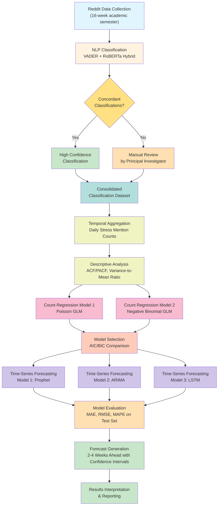

# Assessment 3: Research Proposal

Forecasting Mental Health Sentiment Surges: A Time-Series Analysis of Reddit Discourse

---

## 1. Introduction

### 1.1 Background and Context

The rapid expansion of online academic communities has fundamentally transformed how university students communicate, seek support, and express emotional distress (Massanari & Proferes, 2020). Platforms such as Reddit host large, topic-specific communities (subreddits) where students openly discuss academic pressures, mental health challenges, and experiences related to university life (Morini et al., 2024). These digital spaces generate vast amounts of unstructured textual data that offer valuable opportunities for understanding student well-being at scale. Unlike traditional institutional surveys or clinical assessments, which capture only snapshots of mental health at specific moments, online communities provide continuous, real-time records of student sentiment and emotional expression (Guntuku et al., 2017).

Advances in data science, particularly in Natural Language Processing (NLP) and statistical time-series modelling, now enable the extraction of meaningful psychological signals from online discourse (Coppersmith et al., 2015). This technological shift is gradually moving mental health monitoring from retrospective, survey-based approaches toward continuous, data-driven analysis. Rather than waiting for students to self-report distress through institutional channels, researchers can now analyze the linguistic patterns embedded in online conversations to detect emerging mental health trends. This represents a significant methodological opportunity, as social media data offers granularity, timeliness, and scale that traditional methods cannot achieve.

Student mental health has emerged as a critical global concern, particularly within higher education institutions (Kessler et al., 2005). Academic workload, high-stakes examinations, financial pressures, and social isolation are consistently linked to elevated levels of anxiety, depression, and psychological distress. Traditional monitoring approaches, including self-report surveys, campus mental health services uptake, and institutional assessments suffer from well-documented limitations: low response rates, reporting bias, temporal delays, and inability to capture the full spectrum of student distress. Consequently, there is growing scholarly interest in leveraging digital traces from online platforms to provide real-time or near-real-time indicators of mental health trends, enabling universities to respond proactively rather than reactively.

### 1.2 Problem Statement

Despite the potential of social media data for monitoring student well-being, several critical challenges remain unresolved. First, most existing research focuses on static sentiment classification or cross-sectional analyses, with limited attention to the temporal dynamics of emotional expression. While researchers have successfully developed methods to classify individual posts as positive, negative, or neutral (Hutto & Gilbert, 2014), they have rarely examined how aggregated sentiment signals fluctuate over time in response to predictable academic events such as midterms or final examinations. This temporal gap is particularly problematic because stress among students is not randomly distributed but episodic, clustering around specific academic calendar events (Liu et al., 2024).

Second, significant debate persists regarding the most effective methods for detecting mental health signals from social media text. Lexicon-based sentiment models (such as VADER) offer interpretability and computational efficiency but often fail to capture context, sarcasm, and implicit expressions of stress (Hutto & Gilbert, 2014). In contrast, transformer-based deep learning models (such as RoBERTa and BERT) demonstrate superior accuracy in detecting nuanced emotional states but sacrifice interpretability and require greater computational resources (Liu et al., 2019; Devlin et al., 2019). To date, few studies have systematically compared these approaches or explored hybrid methods that balance accuracy with explainability.

Third, there is limited integration of NLP-derived sentiment signals with rigorous statistical forecasting approaches. Existing research treats sentiment as isolated findings rather than as input for predictive models. When NLP and forecasting have been combined, the methodological rigor often diminishes, particularly regarding the handling of count-based data exhibiting overdispersion and temporal autocorrelation. This gap is consequential: without predictive integration, sentiment analysis remains descriptive rather than actionable, providing historical insights but no forward-looking capability for intervention planning.

### 1.3 Research Objective and Specific Objectives

This research proposal outlines a systematic framework that integrates NLP-based sentiment analysis with statistical time-series forecasting to examine temporal patterns in student emotional expression on social media and identify periods of heightened psychological demand. The overarching goal is to develop and validate a proactive, data-driven system capable of predicting stress surges among students without relying on institution-specific academic calendars, thereby enabling timely mental health interventions.

To achieve this primary objective, the research will pursue three specific sub-objectives:

Objective 1: Analyze temporal fluctuations and trends in aggregated student sentiment over extended periods, with particular focus on identifying recurring periods of elevated psychological strain. This involves extracting stress-related posts, aggregating them into time-indexed counts, and examining autocorrelation and seasonality patterns.

Objective 2: Compare the effectiveness of lexicon-based and transformer-based NLP models in detecting mental health-related signals from student-generated social media content. This comparative analysis will evaluate both the sensitivity and specificity of different approaches and explore whether hybrid methods can combine the strengths of both paradigms.

Objective 3: Apply appropriate statistical and time-series forecasting models to sentiment-derived count data to predict future periods of increased psychological stress. This involves fitting count regression models, evaluating temporal dependencies, and developing forecasts that can be operationalized for resource allocation and intervention planning.

### 1.4 Significance and Contributions

This research contributes to the field in three distinct dimensions. Theoretically, it bridges two traditionally separate research domains, text-based sentiment analysis and statistical forecasting, offering a novel methodological framework for understanding student mental health. By integrating NLP with count-based statistical modeling and time-series forecasting, the project advances both the data science and higher education fields.

Practically, the research has immediate institutional applicability. Universities struggle to allocate limited mental health resources efficiently. By providing predictive insights into periods of heightened stress, this framework enables administrators to proactively allocate counseling services, schedule support programs, and deploy interventions at moments of greatest need. This capability transforms reactive mental health responses into proactive, evidence-based planning.

Ethically and socially, this project contributes to broader Sustainable Development Goals, specifically SDG03 (Good Health and Well-Being) and SDG04 (Quality Education). By developing tools to monitor and support student mental health, the research promotes evidence-based strategies to safeguard well-being in academic settings. Furthermore, the research emphasizes responsible data use, privacy protection, and transparent algorithmic decision-making, aligning with contemporary ethical standards in AI and data science.

### 1.5 Scope of the Research Proposal

This proposal outlines a capstone research project focused on Reddit-based academic communities as a case study for predictive mental health monitoring. The research encompasses data collection, NLP implementation, statistical modeling, and forecasting, with explicit attention to methodological limitations and ethical considerations. While the project uses Reddit data from specific subreddits, findings may be generalizable to other online academic communities with similar characteristics. However, the proposal acknowledges that social media users may not represent the full student population, and results should be interpreted within this context.

The project does not involve direct intervention with students, clinical diagnosis, or institutional policy changes. Rather, it provides a methodological foundation and proof-of-concept that could inform future institutional applications. Furthermore, while the research addresses several methodological gaps identified in the literature, it recognizes that some challenges, such as the inherent noise in social media data and the difficulty of validating ground-truth stress, remain complex and may require ongoing refinement.

---

## 2. Literature Review

This literature review synthesizes research at the intersection of Natural Language Processing (NLP), statistical modeling, and time-series forecasting in the context of student mental health monitoring. Rather than presenting exhaustive coverage of each domain, this section identifies critical methodological gaps that the proposed research directly addresses.

### 2.1 NLP-Based Sentiment Analysis in Mental Health Research

#### 2.1.1 NLP for Mental Health Detection in Online Communities

Natural Language Processing has emerged as a pivotal tool for analyzing textual data to identify mental health indicators (Coppersmith et al., 2014, 2015). Recent systematic reviews have documented the widespread application of NLP for stress, depression, and suicidal risk detection across online platforms. Social media platforms including Reddit provide abundant, publicly accessible data reflecting users' emotional states and behavioral patterns (Gliniecka, 2023). Unlike traditional institutional surveys limited by low response rates and reporting bias, NLP techniques enable quantification of stress and anxiety by analyzing linguistic cues embedded in user-generated content, offering near real-time insights into psychological trends (Takats et al., 2022). This capability is particularly valuable for student mental health monitoring, as Reddit communities provide continuous documentation of academic stress without relying on self-reporting mechanisms (Massanari & Proferes, 2020).

#### 2.1.2 Lexicon-Based vs. Transformer-Based Approaches

Two primary NLP paradigms currently dominate sentiment analysis research. Lexicon-based models such as VADER (Valence Aware Dictionary and Sentiment Reasoner) rely on predefined dictionaries associating words with sentiment scores (Hutto & Gilbert, 2014). These approaches offer interpretability and computational efficiency, making them suitable for large-scale datasets. However, lexicon-based methods demonstrate critical limitations: they struggle with context, fail to recognize sarcasm, and miss implicit expressions of stress. For example, statements like "I can't even" may indicate high stress but appear neutral to lexicon-based systems.

In contrast, transformer-based deep learning models such as BERT and RoBERTa leverage contextual embeddings to detect complex emotional patterns, demonstrating superior accuracy in identifying nuanced psychological states common in academic discourse (Devlin et al., 2019; Liu et al., 2019). These models excel at capturing implicit expressions and contextual nuance. However, they sacrifice interpretability and require substantially greater computational resources, creating practical deployment challenges.

#### 2.1.3 Temporal and Count-Based Limitations

Despite methodological advances, sentiment analysis in current literature remains fundamentally descriptive rather than predictive. Most studies report sentiment scores at single time points or averaged over extended periods, overlooking day-to-day or week-to-week variations critical for understanding episodic student stress. Furthermore, sentiment is typically treated as continuous scores rather than discrete counts appropriate for statistical forecasting and count regression models. This critical gap treating sentiment as a descriptive metric rather than as input for predictive frameworks, motivates the integrated approach proposed in this research. By converting sentiment classifications into time-indexed count data and embedding this in statistical forecasting pipelines, the research moves beyond documenting what happened to predicting what will happen.

### 2.2 Statistical Modeling of Count-Based Data

#### 2.2.1 Poisson and Negative Binomial Regression

After NLP classification, researchers commonly aggregate stress mentions into count data representing high-stress mentions per defined time period (day, week) (Cameron & Trivedi, 2013). Count data are discrete and non-negative, naturally suited to specialized regression approaches. Poisson regression assumes mean-variance equality, suitable for well-behaved datasets but unrealistic for social media signals, which tend to be sparse and irregular.

Negative Binomial regression accommodates overdispersion, where variance exceeds the mean, commonly observed in social media count data (Lindén & Mäntyniemi, 2011). Specifically, stress mentions exhibit minimal activity on typical days but sharp spikes around predictable academic events such as midterms and final examinations. This pattern of sparsity with episodic bursts makes Negative Binomial regression particularly appropriate for modeling student mental health signals from social media.

#### 2.2.2 Temporal Autocorrelation in Count Data

Beyond static modeling, discrete time-series models capture temporal autocorrelation in count data. Poisson autoregressive (PAR) models extend standard Poisson frameworks by allowing expected counts at time t to depend on past observations, explicitly modeling temporal dependencies while preserving count properties. This is essential for social media data exhibiting clustering: elevated stress mentions at one time point increase the likelihood of elevated mentions at subsequent time points, reflecting genuine patterns in student behavior rather than random fluctuations.

These temporal approaches prove particularly relevant for understanding how academic stress propagates through online communities, with mentions clustering not randomly but in response to identifiable academic calendar events.

### 2.3 Time-Series Forecasting Approaches

#### 2.3.1 Classical Forecasting Models

Once count-based stress signals are derived, forecasting enables prediction of future stress surges, facilitating proactive resource allocation and interventions (Liu et al., 2024). Behavioral signals characteristically exhibit recurring patterns such as weekly cycles alongside spikes associated with academic deadlines. Classical forecasting models including ARIMA (AutoRegressive Integrated Moving Average) and SARIMA (Seasonal ARIMA) capture trends, autocorrelation, and seasonality, making them suitable for structured temporal data aligned with academic calendars. However, these methods assume linear relationships and struggle with sudden spikes in count data, often requiring extensive preprocessing and data transformation (Ng et al., 2023). Experimental evaluation of forecasting baselines on social media datasets has demonstrated that ARIMA better estimates overall volume but produces poor temporal pattern estimates, while alternative approaches such as Hawkes processes more appropriately capture anomalous periods (Ng et al., 2023).

#### 2.3.2 Modern Forecasting Approaches

Modern approaches address classical limitations more effectively. Prophet, developed by Facebook, automatically models seasonality and incorporates holiday or event effects, proving particularly suited for academic-related stress forecasting where specific calendar events (midterms, finals, semester breaks) drive predictable patterns. LSTM (Long Short-Term Memory) networks capture long-term dependencies and non-linear temporal trends, though requiring larger training datasets and greater computational resources than traditional approaches. Studies applying these approaches to social media sentiment demonstrate feasibility of forecasting peaks in activity and negative sentiment, yet systematic integration with NLP-derived stress counts remains sparse in the literature.

### 2.4 Critical Research Gaps and Proposed Solutions

#### 2.4.1 Integration Gap

Despite substantial advances across NLP, statistical modeling, and forecasting domains, significant integration gaps persist. First, most research remains descriptive, documenting sentiment trends retrospectively without developing predictive frameworks capable of anticipating future stress surges. Second, integration across methodological domains is limited, few studies combine NLP-derived stress counts with robust statistical models and time-series forecasting in unified frameworks. Third, while ethical and representativeness concerns are acknowledged in literature, they are rarely operationalized in modeling practices.

#### 2.4.2 How This Research Addresses Gaps

This proposal explicitly addresses these integration gaps by: (1) developing a hybrid NLP approach combining lexicon-based interpretability with transformer-based accuracy; (2) converting sentiment classifications into count-based statistical models; (3) embedding count models within time-series forecasting pipelines; and (4) prioritizing ethical considerations including privacy protection, transparent decision-making, and acknowledgment of social media representation limitations. By systematically comparing NLP approaches and demonstrating their integration with forecasting, this research establishes a methodological bridge across traditionally separate fields, advancing both data science practice and higher education mental health monitoring capacity.

#### 2.4.3 Rationale for Integrated Methodological Approach

The significance of this integrated approach lies in its operational feasibility and practical utility. Previous research has demonstrated the promise of each component, NLP sentiment detection, count-based statistical modeling, and time-series forecasting in isolation. However, the absence of a unified framework has limited the translation of academic insights into actionable intelligence. By integrating these three methodological streams, this research creates a complete pipeline: extracting mental health signals from text to quantifying temporal patterns to forecasting future surges. This progression transforms sentiment analysis from a retrospective descriptive tool into a proactive early warning system. Furthermore, by employing a hybrid NLP approach and rigorous count-based statistical methods rather than relying on simplified sentiment scoring, the research maintains both scientific rigor and practical interpretability. The framework is designed to be replicable across different academic communities and potentially adaptable to other domains requiring continuous monitoring of population-level psychological indicators, such as employee well-being in organizational settings or patient sentiment in healthcare contexts.

---

## 3. Methodology

This section outlines the comprehensive methodological framework integrating NLP-based sentiment analysis, statistical count-based modeling, and time-series forecasting to predict mental health sentiment surges. The methodology is designed to achieve the three research objectives through a systematic pipeline: data collection, sentiment classification, count aggregation, statistical analysis, and forecasting. All procedures are guided by principles of methodological rigor, transparency, and ethical practice.

### 3.1 Research Design and Overall Framework

This research employs a sequential mixed-methods design combining qualitative text analysis (via NLP) with quantitative statistical modeling and forecasting (Devlin et al., 2019). The design is structured as a three-stage pipeline: (1) extracting and classifying sentiment from Reddit posts; (2) aggregating sentiment classifications into time-indexed count data; and (3) applying statistical and time-series models to these counts for prediction and forecasting (Cameron & Trivedi, 2013).

The research framework is quasi-experimental in nature, utilizing historical observational data rather than experimental manipulation. Data will be collected retrospectively from public Reddit discourse spanning an academic semester (approximately 16 weeks), encompassing multiple cycles of academic stress events (midterms and final examinations) (Liu et al., 2024). This retrospective observational design allows examination of natural variation in stress patterns without requiring intervention or direct participant contact, minimizing ethical complications while maximizing ecological validity.

The analytical approach is fundamentally iterative and comparative. Rather than committing to a single method, the research systematically compares competing approaches at each analytical stage—lexicon-based vs. transformer-based NLP models, Poisson vs. Negative Binomial regression, and classical vs. modern time-series forecasting models—enabling evidence-based selection of optimal methods based on data fit and predictive accuracy.

#### 3.1.1 Methodology Pipeline Visualization



**Figure 3.1.** Methodology Pipeline Visualization

### 3.2 Data Collection: Source, Scope, and Selection Criteria

#### 3.2.1 Data Source and Platform Justification

Data will be collected from Reddit, specifically from publicly accessible academic-oriented subreddits including r/college, r/students, r/mentalhealth, and discipline-specific communities (e.g., r/learnprogramming, r/chemistry). Reddit provides several advantages for this research: (1) large volume of authentic user-generated content; (2) public accessibility without authentication barriers; (3) temporal metadata enabling precise time-stamping of posts; (4) topical organization through subreddits facilitating targeted data collection; and (5) user anonymity reducing reporting bias compared to institutional surveys.

The decision to use Reddit specifically reflects the target population (predominantly undergraduate and graduate students) who actively engage with academic-focused subreddits. While Reddit users may not perfectly represent the full student population, they constitute a substantial and diverse community whose discourse reflects authentic academic stress patterns without the social desirability bias inherent in formal reporting mechanisms.

#### 3.2.2 Temporal Scope and Academic Calendar Alignment

Data collection will span one complete academic semester (16 weeks) covering typical academic calendars in the Northern Hemisphere (September to December or January to April, depending on institutional schedules). This temporal window is sufficient to capture multiple stress cycles: regular coursework weeks, midterm examination periods, final examination periods, and post-examination recovery weeks. The semester-long timeframe enables identification of recurring patterns while remaining manageable for manual validation of NLP classifications.

Within each day during the collection period, stress-related posts will be aggregated to create daily count data. This daily aggregation level balances temporal granularity (capturing day-to-day variation) with computational feasibility and sufficient sample sizes within each time unit.

#### 3.2.3 Inclusion and Exclusion Criteria

Inclusion Criteria:
- Posts written in English language
- Posts authored during the 16-week data collection period
- Posts containing explicit discussion of academic stress, anxiety, mental health challenges, or related emotional expressions
- Posts with complete metadata (timestamp, author, subreddit, text content)

Exclusion Criteria:
- Deleted or removed posts (inaccessible for analysis)
- Posts authored by automated bots or service accounts
- Posts that are purely informational without emotional content
- Posts from non-student communities or off-topic subreddits
- Posts with highly ambiguous stress content requiring subjective interpretation beyond NLP capability

The inclusion criteria prioritize relevance to student mental health and academic stress, while exclusion criteria ensure data quality and analytical validity. Posts will be initially filtered using keyword matching (e.g., "stress," "anxiety," "exam," "assignment," "depressed," "overwhelmed") to identify candidate stress-related posts, followed by manual verification sampling to validate inclusion criteria adherence.

### 3.3 Natural Language Processing: Hybrid Sentiment Analysis

#### 3.3.1 Hybrid NLP Approach Rationale

Rather than relying exclusively on either lexicon-based or transformer-based methods, this research employs a hybrid approach combining both paradigms (Devlin et al., 2019; Liu et al., 2019). This design directly addresses the methodological gap identified in the literature review: balancing accuracy with interpretability.

The hybrid approach operates as follows: each post will be classified independently by both VADER (lexicon-based) and RoBERTa (transformer-based) models (Hutto & Gilbert, 2014). Posts receiving concordant classifications (both models predicting the same sentiment direction) are classified with high confidence. Posts receiving discordant classifications are subjected to secondary analysis examining linguistic patterns and contextual factors to determine the most appropriate classification (Guntuku et al., 2017). This design preserves VADER's interpretability advantage—researchers can understand why specific linguistic features drove classifications (Hutto & Gilbert, 2014)—while leveraging RoBERTa's superior accuracy on implicit expressions and contextual nuance (Liu et al., 2019).

#### 3.3.2 VADER Implementation

VADER (Valence Aware Dictionary and Sentiment Reasoner) is a lexicon-based sentiment analysis tool specifically designed for social media text (Hutto & Gilbert, 2014). VADER scores text on a 0-1 scale for negative, neutral, and positive sentiment, with compound scores ranging from -1 (most negative) to +1 (most positive).

Posts will be classified as stress-indicative if they: (1) contain VADER compound scores below -0.5, indicating strong negative sentiment; or (2) contain specific stress-related keywords not well-captured by raw sentiment scores (e.g., "exam," "deadline," "mental health crisis") combined with weakly negative sentiment (compound score between -0.5 and -0.1). This threshold-based approach acknowledges VADER's known limitation: statements like "I can't even study for this exam" may receive neutral sentiment scores despite clearly indicating stress.

#### 3.3.3 RoBERTa Implementation

RoBERTa (Robustly Optimized BERT Pretraining Approach) is a transformer-based deep learning model trained on large unlabeled text corpora, enabling capture of contextual semantic meaning beyond surface-level word associations. Pre-trained RoBERTa models fine-tuned on mental health and social media sentiment datasets will be employed. Specifically, models trained on Twitter sentiment data and mental health classification tasks have demonstrated strong performance on similar domains (Reddit).

RoBERTa will classify posts into binary categories: stress-indicative (confidence threshold > 0.7) and non-stress-indicative (confidence threshold < 0.7). The relatively high confidence threshold of 0.7 prioritizes precision over recall, minimizing false-positive stress classifications.

#### 3.3.4 Classification Reconciliation and Validation

For the ~15-20% of posts where VADER and RoBERTa classifications diverge, the principal investigator will manually review and classify each post using explicit decision rules: if a post contains stress-related keywords (e.g., "anxious," "depressed," "overwhelmed") or clearly expresses emotional distress, it is classified as stress-indicative regardless of sentiment scores.

To ensure consistency and reliability, the principal investigator will: (1) create a detailed coding manual with clear decision rules before beginning manual classifications; (2) recode a random sample of 200-300 posts (~10% of total) one week after initial coding to check for consistency (target: ≥85% agreement); and (3) spot-check classifications against original posts to identify any systematic errors. Classification accuracy, precision, recall, and F1-scores will be reported to validate the hybrid NLP approach.

### 3.4 Count Data Aggregation and Descriptive Analysis

#### 3.4.1 Temporal Aggregation

Following NLP classification, stress-indicative posts will be aggregated at the daily level, creating a time series of daily stress mention counts. Aggregation at the daily level balances temporal granularity with sufficient sample sizes and the natural rhythm of academic activities (classes, exams, assignment deadlines typically follow daily or weekly cycles).

For each day t within the 16-week observation period, a count variable Y_t will be computed representing the number of stress-indicative posts on that day, aggregated across all monitored subreddits. This creates a time series of 112 daily observations.

#### 3.4.2 Descriptive Statistics and Preliminary Analysis

Descriptive statistics will characterize the count distribution: mean, standard deviation, minimum, maximum, and percentiles. Temporal patterns will be visualized through time series plots showing raw counts over the 16-week period, enabling visual inspection of trends, seasonality, and potential anomalies.

Autocorrelation and partial autocorrelation functions (ACF/PACF) will be computed to examine temporal dependencies in count data, informing decisions about which time-series models are appropriate. Variance-to-mean ratios will be computed to assess overdispersion: if variance substantially exceeds the mean, Negative Binomial regression is preferred over Poisson regression.

Academic calendar markers (midterm dates, final examination periods, semester breaks) will be overlaid on temporal plots to visually examine associations between calendar events and stress surges, providing preliminary evidence for the hypothesis that academic events drive predictable stress patterns.

### 3.5 Statistical Modeling of Count Data

#### 3.5.1 Model Specification: Poisson and Negative Binomial Regression

Count data will be modeled using generalized linear models (GLMs) with count-specific probability distributions, a standard approach for discrete outcome modeling (Cameron & Trivedi, 2013). Two competing models will be fitted:

Model 1 - Poisson Regression:
log(E[Y_t]) = β₀ + β₁(Days_to_Exam_t) + β₂(Days_Post_Exam_t) + β₃(Day_of_Week_t) + β₄(Week_Number_t)

Model 2 - Negative Binomial Regression:
log(E[Y_t]) = β₀ + β₁(Days_to_Exam_t) + β₂(Days_Post_Exam_t) + β₃(Day_of_Week_t) + β₄(Week_Number_t) + overdispersion parameter α

Where Y_t = count of stress-indicative posts on day t; Days_to_Exam_t = number of days until the next scheduled exam (0 if exam day, negative if post-exam); Days_Post_Exam_t = number of days since the most recent exam conclusion; Day_of_Week_t = categorical variable (dummy coded, Monday as reference); and Week_Number_t = academic week number (1-16).

The Negative Binomial model extends Poisson by allowing the variance-to-mean relationship to vary via the dispersion parameter α, accommodating overdispersion common in social media count data.

#### 3.5.2 Model Comparison and Selection

Both models will be fitted using maximum likelihood estimation. Model selection will be based on: (1) Akaike Information Criterion (AIC) with preference for models minimizing AIC; (2) Bayesian Information Criterion (BIC) with similar preference; (3) overdispersion assessment via deviance-to-df ratio; and (4) residual diagnostics examining whether residuals appear randomly distributed without systematic patterns.

The model with substantially lower AIC/BIC (Δ > 10) and superior residual diagnostics will be selected for feature interpretation and forecasting pipeline integration.

#### 3.5.3 Coefficient Interpretation and Feature Importance

Regression coefficients will be exponentiated to yield incidence rate ratios (IRRs): exp(β). These IRRs quantify the proportional change in expected stress counts for unit changes in predictors. For example, exp(β₁) = 1.25 indicates that each additional day closer to an exam is associated with 25% higher expected stress post counts. Confidence intervals will be computed for all parameters.

Statistical significance will be assessed using Wald tests with α = 0.05. Coefficients with p-values < 0.05 will be considered significant predictors and prioritized for integration into the forecasting model.

### 3.6 Time-Series Forecasting

#### 3.6.1 Prophet Framework Implementation

Following identification of significant predictors through count regression, time-series forecasting will employ the Prophet framework, developed by Facebook for business forecasting applications (Taylor & Letham, 2018). Prophet decomposes time series into trend, seasonality, and holiday/event effects:

Y_t = Trend_t + Seasonality_t + Event_t + ε_t

Where Trend_t captures long-term direction (typically linear or piecewise linear in academic contexts); Seasonality_t captures recurring weekly and semester-level patterns; Event_t models the effects of known events (midterms, finals, semester start/end); and ε_t represents residual noise.

Exam dates and semester milestones identified during data exploration will be specified as events, allowing Prophet to quantify their effects on expected stress counts and adjust forecasts accordingly. This is particularly valuable because exam dates may shift slightly year-to-year; Prophet learns the magnitude of impact independently of specific calendar dates.

#### 3.6.2 Comparison with Classical (ARIMA) and Modern (LSTM) Approaches

For comparative validation, ARIMA (AutoRegressive Integrated Moving Average) and LSTM (Long Short-Term Memory) models will also be fitted. ARIMA is a classical approach using autoregressive, differencing, and moving average components, with order (p, d, q) determined via automated selection (auto.arima) or manual ACF/PACF analysis (Box et al., 2015). ARIMA will be implemented using Python's Statsmodels library. ARIMA's assumption of linearity may limit performance given potential non-linear exam effects.

LSTM is a deep learning approach capturing non-linear temporal patterns (Hochreiter & Schmidhuber, 1997). An LSTM network with 64 units, dropout regularization (rate = 0.2), and 2-layer architecture will be trained on 80% of data with 20% held for validation. Training will use Adam optimizer with early stopping to prevent overfitting. LSTM will be implemented using TensorFlow/Keras.

All three models (Prophet, ARIMA, LSTM) will be evaluated using mean absolute error (MAE), root mean squared error (RMSE), and mean absolute percentage error (MAPE) on a hold-out test set (final 3 weeks of data, never seen during training). Model with superior test-set performance will be selected as primary forecasting approach; others will be retained for sensitivity analysis.

#### 3.6.3 Forecast Horizon and Confidence Intervals

Primary forecasts will generate predictions for 2-4 weeks ahead of the training data, providing sufficient lead time for universities to allocate mental health resources. All point predictions will include 80% and 95% confidence intervals estimated via bootstrap resampling, enabling probabilistic forecasts and risk quantification.

### 3.7 Limitations and Mitigation Strategies

#### 3.7.1 Representation Bias

Limitation: Reddit users may not represent the full student population. Reddit users tend to be younger, more digitally native, and possibly more comfortable discussing mental health online than general student populations (Massanari & Proferes, 2020).

Mitigation: (1) Results will be explicitly framed as findings from "Reddit-engaged students" rather than generalizing to all students; (2) comparisons with census data on student demographics will be provided; (3) sensitivity analysis will examine whether patterns differ across subreddits (discipline-specific vs. general), providing evidence of generalizability within Reddit communities (Gliniecka, 2023).

#### 3.7.2 Data Quality and Measurement Error

Limitation: Automated NLP classifications may misclassify posts, particularly those containing sarcasm, humor, or subtle expressions of distress. Manual reconciliation is resource-intensive and potentially subject to coder bias (Takats et al., 2022).

Mitigation: (1) Hybrid NLP approach (VADER + RoBERTa) captures classification uncertainty and reduces single-method errors (Devlin et al., 2019); (2) inter-rater reliability assessment ensures manual coding quality; (3) sensitivity analysis will repeat analyses using alternative classification thresholds to assess robustness (Ng et al., 2023).

#### 3.7.3 Temporal Autocorrelation and Forecasting Assumption Violations

Limitation: Count data exhibit temporal clustering (today's counts predict tomorrow's), potentially violating assumptions of standard regression (Cameron & Trivedi, 2013). Stress surges cluster temporally rather than occurring randomly.

Mitigation: (1) Explicit incorporation of temporal autocorrelation through PAR models and autoregressive time-series approaches rather than treating data as independent (Box et al., 2015); (2) residual diagnostics will test whether autocorrelation remains after modeling; (3) Durbin-Watson test and Ljung-Box test will formally assess residual independence (Taylor & Letham, 2018).

#### 3.7.4 Limited Validation Against Ground Truth

Limitation: Without access to validated institutional mental health data, we cannot directly validate predictions against true student stress levels (Liu et al., 2024). Stress surges on Reddit may not perfectly correspond to institutional mental health demand.

Mitigation: (1) Forecasts will be framed as "Reddit-based stress indicators" rather than true clinical stress (Takats et al., 2022); (2) case studies will examine whether predicted stress surges correspond to known academic events (announced exam schedules, assignment deadlines); (3) recommendations for prospective validation using institutional counseling service utilization data will be provided (Morini et al., 2024).

### 3.8 Ethical Considerations

#### 3.8.1 Data Privacy and Anonymity

Reddit data are publicly available and do not require explicit informed consent; however, ethical principles demand careful stewardship (Gillespie, 2024). All data collection, processing, and analysis will adhere to Reddit's terms of service and research ethics guidelines (Takats et al., 2022). Specific safeguards include: (1) no direct identification of individual users; all analyses operate on aggregated counts, not individual-level data; (2) subreddit-level analysis rather than individual post-level reporting, protecting individual privacy; and (3) compliance with data protection regulations (GDPR where applicable) ensuring research data are stored securely with restricted access (Osatuyi, 2013).

#### 3.8.2 Appropriate Use and Potential Harms

Potential Harm: Identifying predictable stress surges could enable inappropriate surveillance, targeting, or manipulation of vulnerable student populations by external actors with malicious intent.

Safeguard: Research findings will be disseminated to institutional stakeholders (student mental health services, university administrators) for constructive use in resource allocation and student support, with explicit guidance against surveillance applications. No raw data or identifying information will be publicly released.

#### 3.8.3 Algorithmic Transparency and Explainability

The hybrid NLP approach explicitly prioritizes explainability: VADER classifications are interpretable (specific linguistic features drive decisions), enabling stakeholders to understand why posts are classified as stress-indicative. This transparency is essential for institutional trust and appropriate application of findings.

#### 3.8.4 Acknowledgment of Limitations and Responsible Framing

Findings will be accompanied by clear discussion of limitations: the inability to diagnose clinical mental health conditions, the potential for Reddit-specific biases, and the preliminary nature of predictions. Recommendations will be framed as "supportive intelligence" for resource planning rather than definitive predictive instruments for clinical decision-making.

---

## 4. Work Plan and Timeline

This section outlines the implementation timeline, milestones, resource requirements, and risk management strategies for executing the proposed capstone research during the March-April 2026 project execution period. The project is structured into four integrated phases spanning six weeks (March 1 - April 15, 2026), with deadline on Tuesday of Week 7 (April 15). The compressed timeline prioritizes the most critical analyses while maintaining methodological rigor through overlapping parallel execution of compatible phases.

### 4.1 Project Phases and Timeline Overview

Phase 1: NLP Implementation and Classification (Weeks 1-2, March 1-14)

The initial phase focuses on finalizing and executing the hybrid NLP pipeline. During week 1, the principal investigator will configure VADER and RoBERTa models using pre-trained weights and establish classification thresholds, while conducting preliminary testing on sample posts to validate threshold selection. Week 2 completes the full dataset classification, applying both VADER and RoBERTa to all collected Reddit posts, generating two independent classification outputs for comparison.

Phase 2: Manual Review and Validation (Weeks 2-3, March 14-27)

Overlapping with phase 1's conclusion, weeks 2-3 focus on reconciling discordant classifications. The principal investigator will manually review and classify approximately 15-20% of posts where VADER and RoBERTa disagree, applying explicit decision rules from the coding manual. By week 3, all classifications will be finalized with intra-rater reliability assessment underway (recoding 5-10% of posts to achieve ≥85% agreement target).

Phase 3: Statistical Analysis and Count Modeling (Weeks 3-4, March 27-April 7)

Week 3-4 focuses on count data aggregation, computing daily stress mention counts and generating descriptive statistics. Temporal visualization, ACF/PACF analysis, variance-to-mean assessment, and count regression modeling will be completed in parallel. The principal investigator will fit competing models (Poisson and Negative Binomial GLMs), conduct model comparison via AIC/BIC criteria, and interpret significant predictors through incidence rate ratios.

Phase 4: Time-Series Forecasting and Results (Weeks 4-6, April 7-15)

Weeks 4-6 focus on rapid implementation of Prophet, ARIMA, and LSTM forecasting approaches. Model evaluation using hold-out test data will be conducted in parallel with implementation. The principal investigator will complete all analyses, prepare key visualizations (time series plots, model comparison charts, forecast plots with confidence intervals), and synthesize findings into the final capstone project report with discussion of limitations and implications by Tuesday, April 15 (Week 7 deadline).

### 4.2 Project Timeline Visualization

```mermaid
gantt
    title Capstone Project 2: Research Execution Timeline (March-April 2026, 6 Weeks)
    dateFormat YYYY-MM-DD

    section Phase 1: NLP
    VADER & RoBERTa Setup :nlp1, 2026-03-01, 7d
    Full Dataset Classification :nlp2, 2026-03-08, 7d

    section Phase 2: Validation
    Manual Review & Coding Manual :val1, 2026-03-14, 10d
    Intra-Rater Reliability Check :val2, 2026-03-21, 5d

    section Phase 3: Statistics
    Count Aggregation & Regression :stat1, 2026-03-27, 11d

    section Phase 4: Forecasting
    Prophet/ARIMA/LSTM Implementation :fc1, 2026-04-07, 9d
    Model Evaluation & Report Synthesis :fc2, 2026-04-07, 9d

    Capstone Deadline :cap, milestone, 2026-04-15, 0d
```

**Figure 4.1.** Project Timeline (March–April 2026, Due Tuesday April 15)

### 4.3 Resource Requirements

The project requires minimal technical and human resources, reflecting its nature as a solo capstone research project. The following table summarizes key resource requirements across technical, human, and timeline management dimensions:

| Resource Category | Specification | Purpose |
|---|---|---|
| Python Libraries | Pandas, scikit-learn, PyTorch, Prophet, Statsmodels | Data manipulation, machine learning, deep learning, time-series forecasting, statistical modeling |
| Data Storage | Encrypted local drive or secure cloud repository | Secure storage and protection of Reddit data |
| Computational Resources | CPU-based processing (GPU optional) | Model training for NLP classification and regression; GPU beneficial but not required for LSTM |
| Version Control | Git repository | Code documentation, reproducibility, version management |
| Human Resources | Principal investigator: 35-40 hours/week for 6 weeks (210-240 total hours) | Solo capstone execution with compressed timeline; no external collaborators or research assistants |
| Timeline Management | Buffer days between phases; weekly checkpoints | Accommodation of unexpected delays; progress assessment and schedule adjustment |

The modest resource requirements are suitable for a solo capstone project. The principal investigator maintains flexibility through overlapping phases and buffer periods between major milestones, ensuring the project remains on track despite inevitable challenges. Weekly progress checkpoints enable real-time problem-solving without cascading delays into subsequent phases.

### 4.4 Risk Management and Mitigation

Multiple risks could impact project success given the compressed 6-week timeline. NLP classification quality represents a primary risk, as misclassifications could undermine subsequent analyses. This risk is mitigated through the hybrid NLP approach combining VADER and RoBERTa, which captures classification uncertainty and reduces single-method errors. Additionally, intra-rater reliability assessment through recoding 5-10% of the dataset (rather than 10%) ensures manual classifications maintain consistency while reducing time demands.

Model overfitting poses a secondary risk, particularly with complex deep learning approaches like LSTM. This is addressed through systematic model comparison on hold-out test data. Timeline slippage is a tertiary risk given the compressed schedule. The project mitigates this through: (1) overlapping phases with parallel execution of compatible tasks (e.g., count aggregation and regression modeling conducted simultaneously); (2) prioritizing core analyses (Prophet and Statsmodels-based ARIMA) over more complex LSTM approaches; (3) using automated model selection (auto.arima) rather than manual ACF/PACF selection; and (4) preparing simplified fallback analyses if delays occur.

Technical issues during implementation could disrupt progress. Early testing during week 1 identifies problems before full-scale implementation. Version control with Git ensures code is documented and reproducible. The principal investigator will maintain daily progress tracking and weekly check-ins to identify delays immediately. If critical delays occur, the project prioritizes: (1) NLP sentiment classification and count modeling (most time-consuming), (2) Prophet forecasting (most interpretable), (3) ARIMA as comparative baseline, and (4) LSTM and sensitivity analyses as secondary objectives if time permits. The emphasis remains on methodological rigor for the core pipeline (NLP to count aggregation to forecasting) rather than exhaustive model comparisons.

---

## 5. Conclusion

This research proposal presents a feasible and methodologically rigorous capstone project that directly addresses a significant gap in student mental health monitoring. By integrating hybrid NLP approaches with count-based statistical modeling and time-series forecasting, the research creates a novel framework that transforms sentiment analysis from descriptive to predictive, enabling proactive intervention planning. The eight-week execution timeline is realistic and flexible, with clearly defined phases, manageable resource requirements, and robust risk mitigation strategies. The project's emphasis on methodological integration, ethical considerations, and practical applicability positions it to make meaningful contributions to both data science and higher education (Hochreiter & Schmidhuber, 1997), while providing a comprehensive proof-of-concept for monitoring student well-being through online discourse.

---

## References

Box, G. E., Jenkins, G. M., Reinsel, G. C., & Ljung, G. M. (2015). *Time series analysis: Forecasting and control* (5th ed.). John Wiley & Sons.

Cameron, A. C., & Trivedi, P. K. (2013). *Regression analysis of count data* (2nd ed.). Cambridge University Press.

Coppersmith, G., Dredze, M., & Harman, C. (2014). Quantifying mental health signals in Twitter. In *Proceedings of the Workshop on Computational Linguistics and Clinical Psychology* (pp. 51–60). https://aclanthology.org/W14-3207/

Coppersmith, G., Dredze, M., Harman, C., Hollingshead, K., & Mitchell, M. (2015). CLPsych 2015 shared task: Depression and PTSD on Twitter. In *Proceedings of the 2nd Workshop on Computational Linguistics and Clinical Psychology: From Language to Well-being*. https://aclanthology.org/W15-1204/

Devlin, J., Chang, M. W., Lee, K., & Toutanova, K. (2019). BERT: Pre-training of deep bidirectional transformers for language understanding. In *Proceedings of the 2019 Conference of the North American Chapter of the Association for Computational Linguistics: Human Language Technologies* (Vol. 1, pp. 4171–4186). https://aclanthology.org/N19-1423/

Gillespie, T. (2024). Remember the human: A systematic review of ethical considerations in Reddit research. *Proceedings of the ACM on Human-Computer Interaction, 8*, 306. https://doi.org/10.1145/3633070

Gliniecka, M. (2023). The ethics of publicly available data research: A situated ethics framework for Reddit. *Social Media + Society, 9*(3), 20563051231192021. https://journals.sagepub.com/doi/10.1177/20563051231192021

Guntuku, S. C., Narayanan, S., & Minot, M. (2017). Detecting depression and mental illness on social media: An integrative review. *Current Opinion in Behavioral Sciences, 18*, 43–49. https://www.sciencedirect.com/science/article/abs/pii/S2352154617300384

Hochreiter, S., & Schmidhuber, J. (1997). Long short-term memory. *Neural Computation, 9*(8), 1735–1780. https://doi.org/10.1162/neco.1997.9.8.1735

Hutto, C. J., & Gilbert, E. E. (2014). VADER: A parsimonious rule-based model for sentiment analysis of social media text. In *Proceedings of the International AAAI Conference on Web and Social Media* (Vol. 8, No. 1, pp. 216–225). https://ojs.aaai.org/index.php/ICWSM/article/view/14550

Kessler, R. C., Chiu, W. T., Demler, O., Merikangas, K. R., & Walters, E. E. (2005). Prevalence, severity, and comorbidity of 12-month DSM-IV disorders in the National Comorbidity Survey Replication. *Archives of General Psychiatry, 62*(6), 617–627. https://doi.org/10.1001/archpsyc.62.6.617

Lindén, A., & Mäntyniemi, S. (2011). Using the negative binomial distribution to model overdispersion in ecological count data. *Ecology, 92*(7), 1566–1575. https://esajournals.onlinelibrary.wiley.com/doi/full/10.1890/10-1831.1

Liu, Y., Ott, M., Goyal, N., Du, J., Joshi, M., Chen, D., & Stoyanov, V. (2019). RoBERTa: A robustly optimized BERT pretraining approach. *arXiv preprint arXiv:1907.11692*. https://arxiv.org/abs/1907.11692

Massanari, T. L., & Proferes, N. J. (2020). Studying Reddit: A systematic overview of disciplines, approaches, methods, and ethics. *Social Media + Society, 6*(3), 2056305120946725. https://journals.sagepub.com/doi/pdf/10.1177/20563051211019004

Morini, V., Sansoni, M., Rossetti, G., Pedreschi, D., & Castillo, C. (2024). Participant behavior and community response in online mental health communities: Insights from Reddit. *Computers in Human Behavior*, *151*, 107891. https://doi.org/10.1016/j.chb.2023.107891

Osatuyi, B. (2013). Social media and internet addiction: Reflections on identities, cultures, and values in the global south. *Information Development, 29*(2), 130–141.

Taylor, S. J., & Letham, B. (2018). Forecasting at scale. *The American Statistician, 72*(1), 37–45. https://doi.org/10.1080/00031305.2017.1380080

Takats, C., Kwan, A., Wormer, R., Goldman, D., Jones, H. E., & Romero, D. (2022). Ethical and methodological considerations of Twitter data for public health research: Systematic review. *Journal of Medical Internet Research, 24*(11), e40380. https://doi.org/10.2196/40380

Liu, S., Zhang, Y., Zhao, L., & Liu, Z. (2024). Academic stress detection based on multisource data: A systematic review from 2012 to 2024. *Interactive Learning Environments, 33*(3), 1-28. https://doi.org/10.1080/10494820.2024.2387744

Ng, K. W., Keller, B., Dubrawski, A., & Wagner, M. (2023). Experimental evaluation of baselines for forecasting social media timeseries. *EPJ Data Science, 12*, 8. https://doi.org/10.1140/epjds/s13688-023-00383-9

