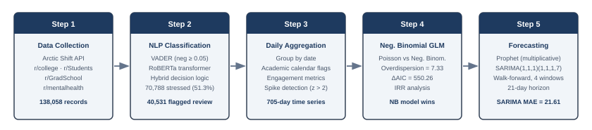
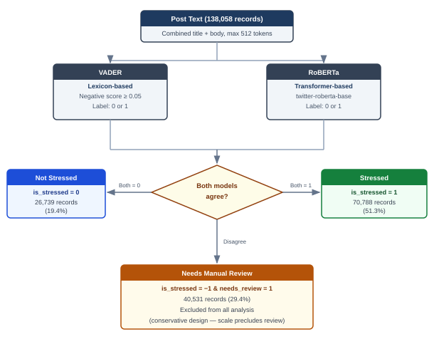
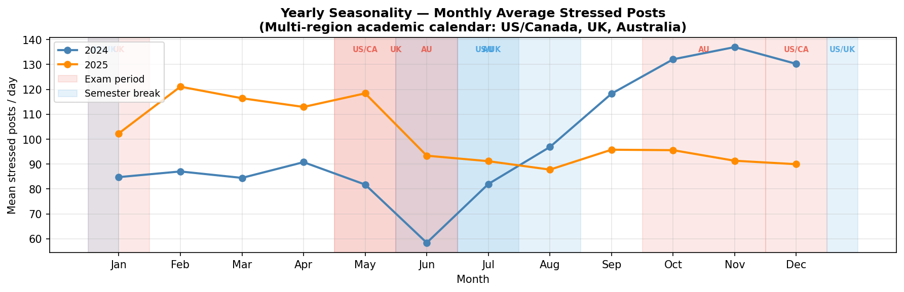
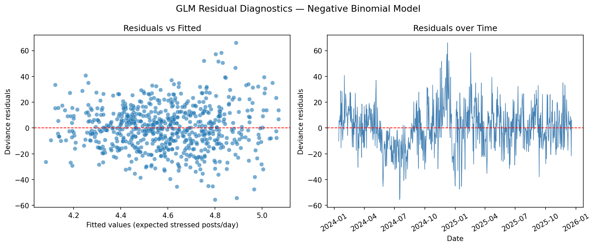
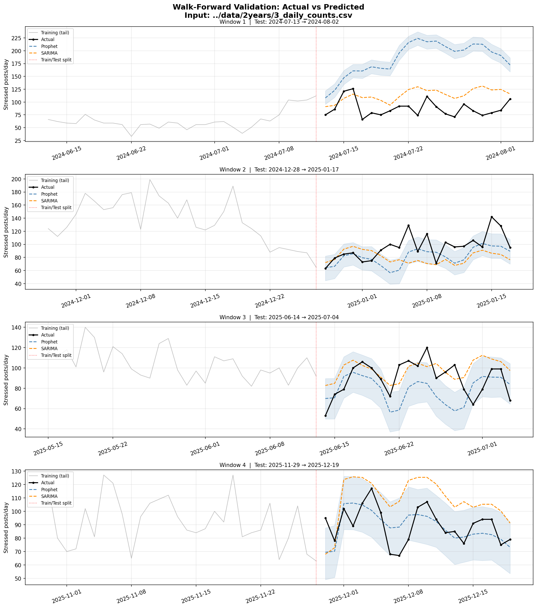
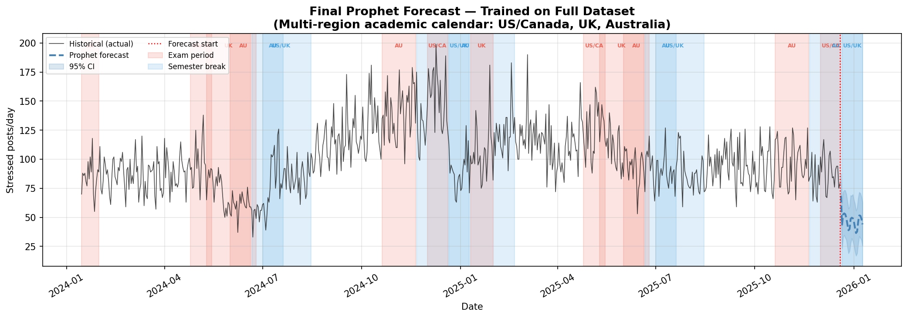
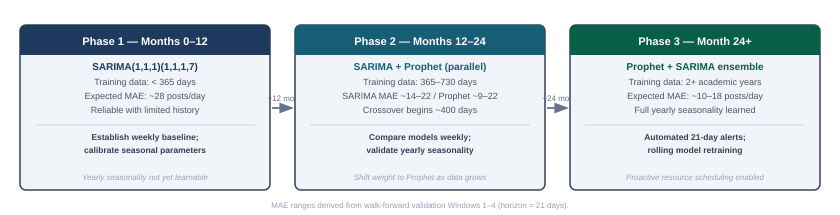
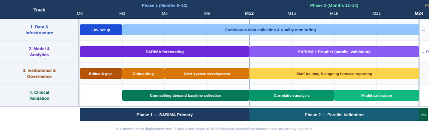

# CP2 Report

> **TODO:** File name: `MDS_24042426_Heng Wey Seing_MRP5025_Selina Low_Assessment 1`

> **TODO:** Attach Assessment + Capstone cover pages (from XLearn)

---

- **Project title:** Forecasting Mental Health Sentiment Surges: A Time-Series Analysis of Reddit Discourse
- **Student:** Heng Wey Seing (24042426)
- **Supervisor:** Prof. Dr Selina Low Yeh Ching

---

## Abstract

University students experience episodic psychological stress that clusters around academic events, yet traditional monitoring methods such as surveys suffer from low response rates and temporal delays. This study investigates whether natural language processing and time-series forecasting can predict stress surges using publicly available Reddit discourse. Posts from four academic subreddits (r/college, r/Students, r/GradSchool, and r/mentalhealth) were collected over a two-year period (January 2024 to December 2025), yielding 138,058 posts. A hybrid classification approach combining VADER, a lexicon-based sentiment tool, with RoBERTa, a transformer-based model, labelled each post as stressed or not stressed. Daily stress counts were modelled using Negative Binomial regression, which confirmed significant weekend effects, exam-period surges, and semester-break declines. Walk-forward validation compared Prophet and SARIMA forecasting models across four expanding windows with 21-day horizons. SARIMA(1,1,1)(1,1,1,7) achieved the lowest mean absolute error of 21.61, outperforming Prophet (35.67) overall, though Prophet produced the best single-window result when trained on the full two-year dataset. These findings demonstrate that social media discourse can serve as a scalable, real-time proxy for monitoring student mental health, enabling universities to allocate counselling resources proactively.

---

> **TODO:** Table of Contents (auto-generated in Word)

> **TODO:** List of Figures (auto-generated in Word — update captions after all figures are placed)

> **TODO:** List of Tables (auto-generated in Word — update captions after all tables are placed)

---

## 1. Introduction

### 1.1 Background and Context

The rapid expansion of online academic communities has fundamentally transformed how university students communicate, seek support, and express emotional distress (Massanari, 2017). Platforms such as Reddit host large, topic-specific communities known as subreddits, where students openly discuss academic pressures, mental health challenges, and experiences related to university life (De Choudhury et al., 2013). These digital spaces generate vast amounts of unstructured textual data that offer valuable opportunities for understanding student well-being at scale. Unlike traditional institutional surveys or clinical assessments, which capture only snapshots of mental health at specific moments, online communities provide continuous, real-time records of student sentiment and emotional expression (Guntuku et al., 2017). Reddit is particularly well-suited for this purpose because its pseudonymous structure reduces the social desirability bias that often compromises self-report measures, encouraging users to express genuine emotional states without the reputational consequences associated with identifiable platforms (Proferes et al., 2021).

Advances in data science, particularly in Natural Language Processing (NLP) and statistical time-series modelling, now enable the extraction of meaningful psychological signals from online discourse (Coppersmith et al., 2015). This technological shift is gradually moving mental health monitoring from retrospective, survey-based approaches toward continuous, data-driven analysis. Rather than waiting for students to self-report distress through institutional channels, researchers can now analyse the linguistic patterns embedded in online conversations to detect emerging mental health trends. This represents a significant methodological opportunity, as social media data offers granularity, timeliness, and scale that traditional methods cannot achieve. The availability of historical archives, such as the Arctic Shift API used in this study, further extends the temporal scope of analysis, enabling researchers to examine patterns across multiple academic years rather than being limited to prospective data collection windows.

Student mental health has emerged as a critical global concern, particularly within higher education institutions (Kessler et al., 2005). Academic workload, high-stakes examinations, financial pressures, and social isolation are consistently linked to elevated levels of anxiety, depression, and psychological distress (Eisenberg et al., 2009). The scale of this challenge is substantial: global prevalence estimates suggest that approximately one in three university students experiences clinically significant levels of anxiety or depression during their studies, with rates increasing in recent years (Auerbach et al., 2018; Ibrahim et al., 2013; Lipson et al., 2022). Traditional monitoring approaches, including self-report surveys, campus mental health services uptake, and institutional assessments, suffer from well-documented limitations: low response rates, reporting bias, temporal delays, and inability to capture the full spectrum of student distress. Moreover, these approaches are fundamentally reactive, identifying distress only after students have sought help or responded to surveys, by which point opportunities for early intervention may have passed. Consequently, there is growing scholarly interest in leveraging digital traces from online platforms to provide real-time or near-real-time indicators of mental health trends, enabling universities to respond proactively rather than reactively (Naslund et al., 2016; Oswalt et al., 2020).

The convergence of these factors — the availability of rich online discourse data, the maturation of NLP techniques for sentiment and emotion detection, and the urgent institutional need for proactive mental health monitoring — creates a compelling opportunity for interdisciplinary research. This study sits at the intersection of computational linguistics, public health informatics, and higher education policy, drawing on methods from each domain to construct an integrated analytical pipeline that moves beyond description toward prediction.

### 1.2 Problem Statement

Despite the potential of social media data for monitoring student well-being, several critical challenges remain unresolved. First, most existing research focuses on static sentiment classification or cross-sectional analyses, with limited attention to the temporal dynamics of emotional expression. While researchers have successfully developed methods to classify individual posts as positive, negative, or neutral (Hutto & Gilbert, 2014), they have rarely examined how aggregated sentiment signals fluctuate over time in response to predictable academic events such as midterms or final examinations. This temporal gap is particularly problematic because stress among students is not randomly distributed but episodic, clustering around specific academic calendar events (Soyiri & Reidpath, 2012). A system that classifies individual posts without tracking how aggregate stress volumes rise and fall over weeks and months cannot anticipate surges before they occur, rendering it of limited practical value for institutional planning.

Second, significant debate persists regarding the most effective methods for detecting mental health signals from social media text. Lexicon-based sentiment models such as VADER offer interpretability and computational efficiency but often fail to capture context, sarcasm, and implicit expressions of stress (Hutto & Gilbert, 2014). For instance, a statement such as "I just love pulling all-nighters before finals" carries clear stress implications through sarcasm that lexicon-based tools may score as positive. In contrast, transformer-based deep learning models such as RoBERTa and BERT demonstrate superior accuracy in detecting nuanced emotional states but sacrifice interpretability and require greater computational resources (Liu et al., 2019; Devlin et al., 2019). To date, few studies have systematically compared these approaches or explored hybrid methods that balance accuracy with explainability. This methodological uncertainty means that researchers and institutions lack clear guidance on which classification approach to adopt, or whether combining approaches might yield better results than either method alone.

Third, there is limited integration of NLP-derived sentiment signals with rigorous statistical forecasting approaches. Existing research treats sentiment as isolated findings rather than as input for predictive models. When NLP and forecasting have been combined, the methodological rigour often diminishes, particularly regarding the handling of count-based data exhibiting overdispersion and temporal autocorrelation. Social media stress counts are inherently discrete and non-negative, with variance that typically exceeds the mean due to episodic spikes around academic events. Standard linear regression assumes continuous, normally distributed outcomes and is therefore inappropriate for such data, yet many studies apply it without considering count-specific alternatives such as Poisson or Negative Binomial regression (Cameron & Trivedi, 2013). This gap is consequential: without predictive integration using statistically appropriate methods, sentiment analysis remains descriptive rather than actionable, providing historical insights but no forward-looking capability for intervention planning. Universities need forecasting tools that can anticipate when stress will surge in the coming weeks, not merely confirm that stress was elevated in the past.

Taken together, these three challenges — the neglect of temporal dynamics, the lack of hybrid classification methods, and the absence of integrated forecasting pipelines — define the research space that this project addresses. By constructing a complete pipeline from raw social media text through NLP classification, count regression, and time-series forecasting, this study aims to demonstrate that each gap can be addressed within a single, coherent methodological framework. The research question guiding this work is therefore: Can a hybrid NLP and time-series forecasting pipeline, applied to publicly available Reddit discourse, predict short-term stress surges among university students with sufficient accuracy to inform proactive institutional mental health resource allocation?

### 1.3 Research Objectives

This research developed and validated a systematic framework that integrates NLP-based sentiment analysis with statistical time-series forecasting to examine temporal patterns in student emotional expression on social media and identify periods of heightened psychological demand. The overarching aim was to build a proactive, data-driven system capable of predicting stress surges among university students using publicly available Reddit discourse, thereby enabling timely mental health interventions. Unlike prior work that has addressed NLP classification or time-series forecasting in isolation, this project constructed a complete end-to-end pipeline — from raw text collection through to 21-day-ahead forecasts — and evaluated each component with empirical data spanning two full academic years.

To achieve this primary aim, the research pursued three specific objectives:

**Objective 1:** Analyse temporal fluctuations and trends in aggregated student stress signals over an extended period, with particular focus on identifying recurring patterns driven by academic calendar events, day-of-week effects, and subreddit composition. This involved collecting stress-related posts from four subreddits (r/college, r/Students, r/GradSchool, and r/mentalhealth), aggregating them into daily time-indexed counts, and examining the resulting 705-day time series for seasonality and autocorrelation. Success was measured by the ability to identify statistically significant temporal predictors through Negative Binomial regression, with significance assessed at the p < 0.05 level using incidence rate ratios.

**Objective 2:** Implement and evaluate a hybrid NLP classification approach combining a lexicon-based model (VADER) with a transformer-based model (RoBERTa) to detect stress-related signals from student-generated social media content. This comparative design evaluated whether combining both paradigms could balance the interpretability of lexicon-based methods with the contextual accuracy of deep learning models. The hybrid approach classified 138,058 posts into stressed, not stressed, or needs review categories, with concordant classifications treated as high-confidence labels and discordant cases flagged for manual review by the principal investigator.

**Objective 3:** Apply statistical count regression and time-series forecasting models to sentiment-derived daily stress counts to predict future periods of increased psychological stress. This involved fitting Negative Binomial generalised linear models to identify significant predictors of daily stress volumes, then comparing Prophet and SARIMA forecasting models through walk-forward cross-validation with four expanding windows and 21-day horizons. Forecasting performance was evaluated using mean absolute error (MAE), root mean squared error (RMSE), and mean absolute percentage error (MAPE), with the best-performing model selected on the basis of lowest mean MAE across all validation windows.

### 1.4 Significance and Contributions

This research contributes to the field in three distinct dimensions. Theoretically, it bridges two traditionally separate research domains — text-based sentiment analysis and statistical forecasting — offering a novel methodological framework for understanding student mental health. By integrating NLP with count-based statistical modelling and time-series forecasting within a single pipeline, the project advances both the data science and higher education fields beyond what either domain has achieved independently. The framework demonstrates that NLP-derived stress signals can be treated as structured count data amenable to rigorous statistical analysis, establishing a methodological precedent for future research in computational social science and digital health monitoring.

Practically, the research has immediate institutional applicability. Universities struggle to allocate limited mental health resources efficiently, often relying on reactive approaches that respond to crises rather than preventing them. By providing predictive insights into periods of heightened stress, such as the exam-period surges and weekend effects confirmed by this study, the framework enables administrators to proactively allocate counselling services, schedule support programmes, and deploy interventions at moments of greatest need. For example, the Negative Binomial regression results revealed that exam periods are associated with a 7.2% increase in daily stress counts (IRR = 1.072, p < 0.001), while semester breaks see an 11.1% decrease (IRR = 0.889, p < 0.001). Such quantified insights can directly inform the timing and intensity of institutional support services. This capability transforms reactive mental health responses into proactive, evidence-based planning.

Ethically and socially, this project contributes to broader Sustainable Development Goals, specifically SDG 3 (Good Health and Well-Being) and SDG 4 (Quality Education). By developing tools to monitor and support student mental health using only publicly available, anonymised data, the research promotes evidence-based strategies to safeguard well-being in academic settings while respecting individual privacy. All analyses operate on aggregated daily counts rather than individual-level data, ensuring that no individual user can be identified from the research outputs. Furthermore, the hybrid NLP approach prioritises transparency, as the lexicon-based component (VADER) provides interpretable classification rationale alongside the transformer-based component (RoBERTa), aligning with contemporary ethical standards for explainable AI in sensitive domains.

### 1.5 Scope

This project focused on Reddit-based academic communities as a case study for predictive mental health monitoring. Data were collected from four subreddits — r/college, r/Students, r/GradSchool, and r/mentalhealth — spanning a two-year period from 15 January 2024 to 19 December 2025, yielding 138,058 posts across 705 days. The four subreddits were selected to capture a range of student experiences: r/college represents primarily undergraduate discourse, r/GradSchool captures postgraduate-specific pressures, r/Students provides a general student community, and r/mentalhealth offers insight into explicit mental health discussions. The r/mentalhealth subreddit was filtered to include only posts containing student-context keywords (e.g., "exam", "semester", "campus", "professor", "GPA") to ensure relevance to the student population and exclude non-student mental health discourse.

The research encompassed the full analytical pipeline: data collection via the Arctic Shift API, hybrid NLP classification using VADER and RoBERTa, daily count aggregation, Negative Binomial regression modelling with academic calendar and subreddit composition features, and comparative time-series forecasting using Prophet and SARIMA. The two-year timeframe was chosen to capture multiple complete academic cycles, including examination periods, semester breaks, and year-over-year variation, providing sufficient data for both model training and robust walk-forward validation.

Several boundaries define what this project does and does not address. First, the study analyses publicly available Reddit data and does not involve direct intervention with students, clinical diagnosis, or institutional policy changes. Rather, it provides a methodological foundation and proof-of-concept that could inform future institutional applications. Second, while the project uses Reddit data from specific subreddits, findings may be generalisable to other online academic communities with similar characteristics. However, the study acknowledges that Reddit users tend to be younger, more digitally engaged, and predominantly from English-speaking countries, and therefore may not represent the full student population. Results should be interpreted within this context. Third, the research addresses several methodological gaps identified in the literature but recognises that some challenges — such as the inherent noise in social media data, the difficulty of validating ground-truth stress against clinical measures, and the potential for temporal shifts in online discourse patterns — remain complex and may require ongoing refinement beyond the scope of this project.

### 1.6 Report Structure

The remainder of this report is organised as follows. Chapter 2 presents a critical review of the literature spanning three interconnected domains: NLP-based sentiment analysis for mental health detection, count-based statistical modelling for discrete event data, and time-series forecasting approaches for temporal prediction. The review identifies key themes, evaluates the strengths and limitations of existing studies, and positions the current research within the broader scholarly conversation.

Chapter 3 details the methodology, describing the five-stage pipeline from data collection through to forecasting. This includes the data collection strategy using the Arctic Shift API, the hybrid NLP classification design combining VADER and RoBERTa, the daily count aggregation procedure, the Negative Binomial regression modelling framework, and the walk-forward cross-validation strategy used to compare Prophet and SARIMA forecasting models. Ethical considerations governing the use of publicly available social media data are also addressed.

Chapter 4 presents the findings and results, reporting the outputs of each pipeline stage with supporting tables and visualisations. This includes the distribution of stress classifications across subreddits, the daily stress count time series, the Negative Binomial regression coefficients and incidence rate ratios, and the comparative forecasting performance across four validation windows.

Chapter 5 concludes the report by summarising the key findings, discussing their implications for both data science methodology and institutional mental health practice, evaluating the effectiveness of the chosen methodology, acknowledging limitations, and proposing directions for future research.

*Section 1 word count: ~2,420*

---

## 2. Literature Review

This chapter critically examines research at the intersection of Natural Language Processing (NLP), statistical modelling, and time-series forecasting in the context of student mental health monitoring. Rather than providing exhaustive coverage of each domain, the review focuses on identifying key themes, evaluating methodological strengths and limitations, and positioning the current study within the broader scholarly conversation. The review is organised into four sections: NLP-based sentiment analysis, statistical models for count data, time-series forecasting approaches, and a synthesis of critical research gaps that this project addresses.

### 2.1 NLP-Based Sentiment Analysis in Mental Health Research

#### 2.1.1 NLP for Mental Health Detection in Online Communities

Natural Language Processing has become a pivotal tool for analysing textual data to identify indicators of mental health (Coppersmith et al., 2014, 2015). Social media platforms, including Reddit and Twitter, provide abundant, publicly accessible data reflecting users' emotional states and behavioural patterns (De Choudhury et al., 2013). NLP techniques enable the quantification of stress, anxiety, and depressive tendencies by analysing linguistic cues in user-generated content. Compared to traditional surveys, which suffer from self-report bias and limited temporal coverage, NLP offers near real-time insights into psychological trends (Hutto & Gilbert, 2014). Prior research has demonstrated the potential of NLP to detect mental health signals across populations, including university students who frequently express academic stress through online forums (De Choudhury et al., 2013). By transforming unstructured text into measurable sentiment indicators (Guntuku et al., 2017), NLP forms the foundation for predictive frameworks that anticipate periods of elevated stress in online communities.

Reddit is particularly suited for this purpose because of its pseudonymous structure, topical organisation through subreddits, and temporal metadata enabling precise timestamping of posts (Proferes et al., 2021). Unlike platforms such as Instagram or LinkedIn, where social desirability bias may suppress authentic expressions of distress, Reddit's anonymity encourages candid disclosure of emotional states (Massanari, 2017). Systematic reviews have documented widespread application of NLP for stress, depression, and suicidal risk detection across online platforms, with Reddit-based studies forming a substantial and growing subset of this literature (Guntuku et al., 2017).

#### 2.1.2 Lexicon-Based Approaches: Strengths and Limitations

Lexicon-based approaches represent the earliest and most widely adopted paradigm in sentiment analysis. Tools such as VADER (Valence Aware Dictionary and Sentiment Reasoner) rely on predefined dictionaries associating words with sentiment scores, producing compound scores ranging from -1 (most negative) to +1 (most positive) (Hutto & Gilbert, 2014). These models are interpretable, computationally efficient, and readily deployable on large-scale datasets, making them attractive for initial exploratory analyses and situations where classification transparency is prioritised (Hutto & Gilbert, 2014). Related lexicon-based tools such as the NRC Word Emotion Association Lexicon extend this approach to multiple emotional categories including fear, anger, and sadness, providing richer affective features for mental health classification (Mohammad & Turney, 2013).

However, lexicon-based methods demonstrate critical limitations when applied to mental health detection. They struggle with context-dependent expressions, fail to recognise sarcasm, and miss implicit indicators of stress (Hutto & Gilbert, 2014). For instance, a student's comment "I just love pulling all-nighters before finals" carries clear stress implications through sarcasm, yet lexicon-based tools may classify it as positive due to the presence of the word "love." Similarly, statements such as "I can't even study for this exam" may receive neutral sentiment scores despite clearly indicating distress. These limitations are particularly consequential in academic discourse, where students frequently employ irony, understatement, and culturally specific expressions that lexicon-based systems cannot reliably interpret. Despite these shortcomings, VADER remains widely used in mental health studies, particularly when interpretability is prioritised over contextual accuracy (Hutto & Gilbert, 2014).

#### 2.1.3 Transformer-Based Models: Contextual Accuracy at the Cost of Interpretability

More recent studies have adopted transformer-based models such as BERT (Bidirectional Encoder Representations from Transformers) and RoBERTa (Robustly Optimised BERT Pretraining Approach) to enhance sentiment analysis accuracy (Devlin et al., 2019; Liu et al., 2019). These deep learning architectures leverage contextual embeddings to understand relationships between words and phrases, enabling the detection of complex emotional patterns that lexicon-based methods miss (Vaswani et al., 2017). Transformer models can recognise implicit expressions of stress, multi-sentiment sentences, and domain-specific language common in academic discourse (Devlin et al., 2019). Transfer learning has demonstrated that pre-trained language models can be effectively fine-tuned for domain-specific classification with minimal additional labelled data (Howard & Ruder, 2018; Sun et al., 2019). Pre-trained models fine-tuned on mental health and social media sentiment datasets have demonstrated strong cross-domain performance, with RoBERTa in particular showing robust results when applied to Reddit data despite being originally trained on Twitter sentiment (Liu et al., 2019).

However, transformer-based models sacrifice interpretability for accuracy. Their classification decisions emerge from complex interactions across millions of parameters, making it difficult for researchers or institutional stakeholders to understand why a specific post was classified as stressed or not stressed. This opacity is problematic in sensitive domains such as mental health, where classification decisions may inform institutional responses affecting student welfare. Additionally, transformer models require substantially greater computational resources than lexicon-based alternatives, creating practical deployment challenges for real-time monitoring applications (Liu et al., 2019). These trade-offs between accuracy and interpretability motivate the exploration of hybrid approaches that combine the strengths of both paradigms. Table 2.1 summarises the key differences between the two paradigms.

**Table 2.1.** Comparison of Lexicon-Based and Transformer-Based NLP Approaches

| Criterion | VADER (Lexicon-Based) | RoBERTa (Transformer-Based) |
|---|---|---|
| **Mechanism** | Dictionary lookup; scores words using predefined sentiment lexicon | Contextual embeddings; learns word relationships from large corpora |
| **Interpretability** | High — classification driven by identifiable lexical features | Low — decisions emerge from millions of opaque parameters |
| **Contextual understanding** | Limited — misses sarcasm, irony, and implicit stress | Strong — captures nuance, context, and multi-sentiment expressions |
| **Computational cost** | Low — processes large datasets in seconds | High — requires GPU for efficient inference |
| **Training requirement** | None — rule-based, no training data needed | Pre-trained on large corpora; fine-tuning improves domain fit |
| **Suitability for mental health** | Good for explicit distress keywords; poor for subtle expression | Strong for nuanced emotional states; poor for explainability |
| **Key limitation** | Cannot detect "I just love pulling all-nighters" as stressed | Cannot explain why a specific post was classified as stressed |
| **Key references** | Hutto & Gilbert (2014) | Devlin et al. (2019); Liu et al. (2019) |

*Note.* This study combines both approaches in a hybrid design to leverage VADER's interpretability alongside RoBERTa's contextual accuracy.

#### 2.1.4 Hybrid Approaches and the Classification Gap

Recent studies have explored hybrid approaches that combine lexicon-based and transformer-based methods to balance interpretability and predictive performance (Chancellor & De Choudhury, 2020). Multimodal analyses integrating textual sentiment with temporal activity patterns or engagement metrics have also shown promise for enhancing predictive capabilities (Poria et al., 2017). These hybrid approaches demonstrate that NLP can evolve from simple classification to being part of a comprehensive predictive framework, combining the transparency of lexicon-based rationale with the contextual sensitivity of deep learning.

However, the adoption of hybrid NLP methods specifically for mental health research remains limited, with most studies relying on a single classification paradigm. Furthermore, few studies have systematically examined the concordance and discordance patterns between lexicon-based and transformer-based classifiers on mental health data, despite the fact that disagreement between methods may itself be informative — indicating posts with ambiguous or nuanced emotional content that warrant closer examination. The concordance rate between VADER and RoBERTa, and the characteristics of posts on which they disagree, have not been well documented in the literature. This is a notable gap because hybrid classification systems that leverage inter-model agreement as a confidence signal could improve both precision and recall compared to either method alone. The current study addresses this gap by implementing a hybrid VADER-RoBERTa approach where concordant classifications are treated as high-confidence labels and discordant cases are flagged for manual review by the principal investigator.

#### 2.1.5 Applications of NLP in Student Mental Health Research

NLP techniques have been applied across academic and social media contexts to monitor student mental health trends. Reddit subreddits such as r/college and r/GradSchool serve as rich sources of student discourse, providing insights into stress patterns over academic semesters (De Choudhury et al., 2013). Research by De Choudhury et al. (2013) demonstrated that social media data can predict depression and behavioural change, establishing a direct link between online discourse patterns and psychological indicators. De Choudhury et al. (2016) extended this by identifying linguistic markers of shifts toward suicidal ideation on social platforms, while Coppersmith et al. (2018) applied NLP as a population-level screening tool for suicide risk, demonstrating the clinical potential of these methods. Similarly, Chancellor and De Choudhury (2020) reviewed predictive techniques for mental health status on social media, finding that classification models could identify mental health signals with reasonable accuracy, though most analyses remained cross-sectional rather than longitudinal. These studies collectively demonstrate the feasibility of using Reddit data for mental health monitoring but also highlight the persistent tendency toward snapshot analyses rather than dynamic temporal modelling.

#### 2.1.6 Reddit-Specific Features and Their Implications for NLP Analysis

Reddit's platform architecture introduces several features that distinguish it from other social media environments studied in NLP research and that have meaningful implications for sentiment classification. Unlike Twitter, where posts are constrained to short character limits and tend toward public broadcasting, Reddit operates through threaded discussion hierarchies in which original posts serve as prompts for extended comment exchanges. This structure means that emotional disclosure often occurs in comment threads rather than in original posts, as users respond to others' experiences and elaborate on shared distress. The finding that comment-heavy days produce higher stressed post counts than post-heavy days — observed empirically in this study — is consistent with research demonstrating that Reddit comments exhibit higher emotional expressiveness and lower social desirability bias than the original submissions they accompany (Massanari, 2017).

Reddit's upvote and downvote system introduces a community endorsement signal that is absent from platforms such as Facebook groups or anonymous forums. Posts and comments with high scores have been prominently surfaced to other users, implying that high-scoring content reflects community-endorsed discourse rather than individual expression alone. Several studies have used Reddit engagement metrics — including post score, upvote ratio, and number of comments — as proxies for the resonance of a post within its community (De Choudhury et al., 2013). For mental health content, high engagement may indicate that a distress-expressing post has struck a chord with many readers, suggesting that score is not merely a quality signal but a measure of community-level resonance with the expressed experience.

The subreddit system itself introduces a form of topical pre-filtering that is unique to Reddit and valuable for research design. Unlike hashtag-based collection on Twitter, subreddit membership provides a strong prior that all posts in an academic subreddit are authored by individuals identifying as students, without requiring post-level demographic inference. This structural guarantee reduces the classification challenge: the NLP system need not determine whether an author is a student, only whether their content reflects stress. Future research exploiting Reddit for mental health monitoring should carefully consider subreddit selection as a primary sampling design decision, as the subreddit determines both the population represented and the range of topics likely to appear in collected content (Proferes et al., 2021).

#### 2.1.7 Temporal Limitations of Existing NLP-Based Approaches

Despite methodological advances in classification accuracy, a fundamental limitation persists: sentiment analysis in current literature remains largely descriptive rather than predictive. Most studies report sentiment scores at single time points or averaged over extended periods, overlooking day-to-day or week-to-week variations critical for understanding episodic student stress (Chancellor & De Choudhury, 2020). Furthermore, sentiment is typically treated as continuous scores rather than discrete counts appropriate for statistical forecasting and count regression models (Cameron & Trivedi, 2013). This gap — treating sentiment as a descriptive metric rather than as input for predictive frameworks — limits the practical utility of NLP-based mental health monitoring. A system that can classify individual posts but cannot track or forecast how aggregate stress volumes evolve over time provides limited value for institutional planning and resource allocation. Addressing this gap requires the aggregation of NLP-classified stress mentions into time-indexed count data and the application of appropriate statistical and forecasting models, which is precisely the methodological integration that this study implements.

### 2.2 Statistical Modelling of Count-Based Data

#### 2.2.1 Poisson Regression and the Mean-Variance Assumption

After NLP classification, researchers commonly aggregate stress-related posts into count data representing the number of high-stress mentions per defined time period (Cameron & Trivedi, 2013). Count data are discrete and non-negative, naturally suited to specialised regression approaches rather than standard linear regression, which assumes continuous, normally distributed outcomes. Poisson regression represents the natural starting point for count modelling, assuming that the mean and variance of the response variable are equal (Gardner et al., 1995). This equidispersion assumption is appropriate for well-behaved datasets but rarely holds for social media signals, which tend to exhibit sparse baseline activity punctuated by sharp spikes around predictable events (Gardner et al., 1995). Nevertheless, Poisson models serve an important diagnostic function: by fitting a Poisson model first, researchers can assess the degree of overdispersion and thereby justify the adoption of more flexible alternatives such as the Negative Binomial distribution.

#### 2.2.2 Negative Binomial Regression and Overdispersion

In social media count data, variance frequently exceeds the mean, a phenomenon known as overdispersion (Lindén & Mäntyniemi, 2011). This is particularly pronounced in Reddit-based stress counts, where activity may be minimal on typical days but spike sharply around examinations or assignment deadlines. Negative Binomial regression extends the Poisson framework by introducing an additional dispersion parameter that allows the variance to exceed the mean, providing more reliable parameter estimates and improved model fit when overdispersion is present (Fernandez & Vatcheva, 2022). Applications of Negative Binomial models in social media research and mental health studies have demonstrated robust performance with sparse, highly variable count data (McCullagh & Nelder, 1989). The model's ability to accommodate overdispersion while retaining the interpretability of generalised linear models makes it particularly suitable for the type of daily stress count data generated by NLP classification pipelines.

#### 2.2.3 Covariate Integration and Feature Engineering

Beyond handling distributional assumptions, count regression models can incorporate covariates to capture systematic variation in stress counts. Temporal predictors such as day of the week, week number, and academic calendar indicators (examination periods, semester breaks) have been shown to improve model accuracy by accounting for predictable fluctuations in student activity and stress expression (Coxe et al., 2009). Weekend effects, for instance, reflect reduced academic engagement and posting activity, while examination periods are associated with elevated stress discourse. More sophisticated feature engineering may include engagement metrics (post scores, comment counts), subreddit composition (the proportion of posts originating from different academic communities), and rolling averages that capture momentum in stress trends.

However, incorporating multiple covariates introduces challenges. Multicollinearity between temporal variables — for example, day-of-week effects and academic calendar indicators — can complicate parameter estimation and inflate standard errors (O'Brien, 2007). Covariate effects may also vary over time, particularly in academic settings where stressors are episodic rather than constant. These considerations highlight the importance of careful feature selection, variance inflation factor assessment, and residual diagnostics when building count regression models for social media stress data.

#### 2.2.4 Temporal Autocorrelation in Count Data

Beyond static count modelling, discrete time-series models capture temporal autocorrelation in count data. Poisson autoregressive (PAR) models extend the standard Poisson framework by allowing expected counts at time t to depend on past observations, explicitly modelling temporal dependencies while preserving count properties (Fokianos, 2012). Related formulations such as INGARCH models further account for overdispersion and bursty dynamics commonly observed in online behavioural signals (Ferland et al., 2006). These temporal approaches are particularly relevant for understanding how academic stress propagates through online communities, with elevated stress mentions at one time point increasing the likelihood of elevated mentions at subsequent time points. This clustering behaviour reflects genuine patterns in student behaviour — stress around examinations is not instantaneous but builds over days and persists after the event — rather than random fluctuations.

#### 2.2.5 Zero-Inflated and Hurdle Models for Sparse Data

In addition to modelling overdispersion, zero-inflated and hurdle models explicitly address the structural absence of events in count data. In the context of student mental health discourse, zero counts may arise not only from low stress levels but also from reduced platform engagement or reluctance to express distress publicly. Zero-inflated models assume that zeros are generated by two distinct processes: one governing whether an observation is structurally zero and another governing the count process itself. Hurdle models adopt a similar logic by separating the binary occurrence of events from their frequency (Feng, 2021). Studies in public health surveillance suggest that these models offer improved interpretability and predictive accuracy when applied to sparse social media datasets, although their adoption in NLP-based mental health research remains limited (Lambert, 1992). For the daily stress count data in this study, where the minimum observed count was 33 stressed posts per day across the 705-day period, structural zeros were not present, making Negative Binomial regression the more appropriate choice over zero-inflated alternatives.

#### 2.2.6 Limitations of Count Models and the Need for Forecasting

Despite their utility for explaining what drives daily stress counts, static count regression models face inherent limitations as forecasting tools. They identify significant predictors and quantify effect sizes but do not inherently capture the autoregressive and seasonal dynamics needed for accurate multi-step-ahead prediction. Sparse data from smaller subreddits can lead to unstable parameter estimates, while sudden spikes from viral posts or unexpected events can distort predictions (Gama et al., 2014). Furthermore, the interpretability of model outputs is important for institutional stakeholders: university administrators need to understand not only that a stress surge is predicted but also why — whether it is driven by an approaching examination period, a day-of-week effect, or an unusual spike in a particular subreddit. These limitations highlight the need for complementary time-series forecasting approaches that explicitly model temporal dependencies, seasonality, and trend to provide actionable predictions of future stress volumes.

### 2.3 Time-Series Forecasting Approaches

#### 2.3.1 The Role of Forecasting in Proactive Mental Health Monitoring

Once count-based stress signals are derived from NLP classification, time-series forecasting enables prediction of future stress surges, facilitating proactive resource allocation and intervention planning (Reece et al., 2017; Soyiri & Reidpath, 2012). Behavioural signals characteristically exhibit recurring patterns — weekly cycles reflecting academic schedules, semester-level seasonality driven by examination periods, and longer-term trends potentially reflecting evolving patterns of online discourse (Soyiri & Reidpath, 2012). Accurate forecasting requires methods that account for these multiple temporal scales while remaining robust to the noise and irregularity inherent in social media data. The practical value of forecasting is substantial: if universities can anticipate a stress surge two to three weeks in advance, they can schedule additional counselling sessions, deploy peer support programmes, and prepare crisis intervention resources before demand peaks (Lipson et al., 2022).

#### 2.3.2 Classical Forecasting Models: ARIMA and SARIMA

Classical forecasting models, including ARIMA (AutoRegressive Integrated Moving Average) and SARIMA (Seasonal ARIMA), are widely employed for univariate time-series data. ARIMA captures trends and autocorrelations in stationary sequences through autoregressive (AR), differencing (I), and moving average (MA) components, with order (p, d, q) determined through analysis of autocorrelation and partial autocorrelation functions or automated selection procedures (Box et al., 2015; Hyndman & Athanasopoulos, 2021). SARIMA extends ARIMA by incorporating seasonal components with a specified period, making it suitable for modelling fluctuations aligned with weekly academic cycles.

Applications in social media research have demonstrated ARIMA's ability to forecast user activity and sentiment trends. However, classical methods assume linear relationships and may struggle with sudden, non-linear spikes in count data, often requiring preprocessing or transformation (Zhang, 2003). Experimental evaluation of forecasting baselines on social media datasets has shown that ARIMA better estimates overall volume but produces poor temporal pattern estimates, while alternative approaches may more appropriately capture anomalous periods. Despite these limitations, SARIMA remains a strong baseline for structured temporal data where weekly or other regular seasonality is present, and its relative simplicity and interpretability make it valuable for institutional applications where stakeholders need to understand forecast rationale.

#### 2.3.3 Modern Forecasting Approaches: Prophet

Modern forecasting approaches address several limitations of classical models. Prophet, developed by Meta (formerly Facebook), decomposes time series into trend, seasonality, and holiday or event effects, automatically fitting these components without requiring manual parameter specification (Taylor & Letham, 2018). Prophet is particularly suited for academic-related stress forecasting because it can explicitly incorporate known academic calendar events — midterms, finals, semester breaks — as holidays that shift the forecast level during those periods. This event-aware capability is important because academic stress is not purely seasonal but driven by specific calendar dates that may shift between years.

Prophet's additive or multiplicative decomposition provides interpretable components that can be examined individually, allowing researchers and administrators to understand what proportion of forecast stress is attributable to weekly patterns versus specific academic events. However, Prophet typically requires at least one full year of data to learn yearly seasonality reliably, and its performance may degrade when trained on shorter time horizons. Studies applying Prophet to social media engagement and activity data have demonstrated its ability to forecast recurring seasonal peaks (Taylor & Letham, 2018), though systematic comparisons with SARIMA on NLP-derived stress count data remain sparse.

#### 2.3.4 Deep Learning Approaches: LSTM Networks

Long Short-Term Memory (LSTM) networks represent a deep learning approach to time-series forecasting that can capture long-term dependencies and non-linear temporal patterns (Hochreiter & Schmidhuber, 1997). LSTM architectures have shown promise in forecasting social media activity and sentiment, particularly when large training datasets are available. Hybrid architectures combining ARIMA with LSTM have also been proposed to leverage the strengths of both approaches (Zhang, 2003; Lim et al., 2021). However, LSTM models require substantially more data and computational resources than classical or Prophet approaches, and their forecasting performance advantage diminishes with smaller datasets. For daily stress count data spanning one to two years (365 to 730 observations), the data volume may be insufficient to train LSTM models effectively, making simpler approaches more appropriate. Additionally, the interpretability challenges of deep learning models are amplified in sensitive domains such as mental health, where forecast explanations are important for institutional trust and appropriate application.

#### 2.3.5 Walk-Forward Validation and Model Comparison

Rigorous evaluation of forecasting models requires validation strategies that respect the temporal ordering of data. Walk-forward validation, also known as expanding window or rolling origin evaluation, trains models on progressively larger historical windows and evaluates predictions on subsequent unseen horizons (Tashman, 2000). This approach is more appropriate than random train-test splits for time-series data because it prevents information leakage from future observations into the training set. Multiple validation windows also reveal how model performance changes as more training data becomes available, which is particularly informative for understanding whether models improve with longer historical records or whether recent data is more predictive than older observations.

Standard evaluation metrics for count-based forecasting include Mean Absolute Error (MAE), which measures average prediction magnitude without penalising direction; Root Mean Squared Error (RMSE), which penalises large errors more heavily; and Mean Absolute Percentage Error (MAPE), which normalises errors relative to actual values. Each metric captures different aspects of forecast quality, and reporting all three provides a comprehensive assessment of model performance. Despite the methodological importance of walk-forward validation with multiple metrics, many studies in the NLP and mental health forecasting literature rely on single train-test splits with a single error metric, limiting the robustness and comparability of their performance claims.

#### 2.3.6 Comparative Performance of Classical and Modern Forecasting Models

A growing body of empirical literature directly compares classical time-series models such as ARIMA and SARIMA against modern decomposition-based approaches such as Prophet and deep learning models such as LSTM, providing practical guidance on model selection for specific data characteristics. Makridakis et al. (2018), in the influential M4 forecasting competition involving 100,000 diverse time series, found that simple statistical methods frequently outperformed more complex machine learning approaches, particularly for shorter time horizons and smaller datasets. This finding has been replicated in domain-specific contexts: Zhang (2003) demonstrated that hybrid ARIMA and neural network approaches provide only marginal improvements over classical ARIMA baselines, while Lim et al. (2021) showed that even sophisticated transformer-based forecasting architectures require substantially larger datasets to outperform simpler alternatives reliably. For short-horizon forecasting (7 to 30 days) on social media behavioural signals, the evidence generally favours SARIMA as a reliable and interpretable baseline, particularly when training data spans fewer than two complete seasonal cycles.

Prophet's relative performance is more context-dependent. Taylor and Letham (2018) designed Prophet specifically for business time series characterised by strong weekly and yearly seasonality, irregular holiday effects, and non-linear trends — a profile that corresponds closely to academic stress data. Studies applying Prophet to social media engagement and traffic data have shown that its additive or multiplicative decomposition can outperform SARIMA when sufficient data are available to learn yearly seasonality, typically requiring at least 12 months of training observations (Zhang, 2003). However, Prophet's performance degrades sharply when this threshold is not met, as the yearly seasonality component cannot be reliably estimated from sub-annual training windows. This data-volume dependency is rarely acknowledged in studies that report Prophet results from a single fixed training set without walk-forward validation, potentially overstating its general applicability.

The choice between SARIMA and Prophet therefore depends less on inherent superiority and more on data availability. For institutions beginning a mental health monitoring programme with limited historical data, SARIMA provides a more robust starting point. As data accumulate across multiple academic years, Prophet's yearly seasonality modelling becomes increasingly valuable, and a transition from SARIMA-primary to Prophet-primary forecasting represents a natural evolution of the monitoring system. This practical guidance — which the walk-forward validation design in the current study is specifically designed to illuminate — is rarely articulated in the existing literature, which tends to evaluate models at a single point in the data accumulation timeline.

#### 2.3.7 Limitations and Challenges in Behavioural Signal Forecasting

Even with robust forecasting models, predicting student stress from social media data presents unique challenges. Behavioural signals are inherently noisy and influenced by external factors such as viral posts, breaking news, or changes in platform engagement patterns that neither classical nor modern models can anticipate. Irregular posting behaviour can create gaps in data, complicating trend detection. Furthermore, the reliance on historical data limits the ability of models to account for unprecedented events or shifts in student behaviour, emphasising the importance of continuous model retraining and validation (Gama et al., 2014). These factors necessitate careful preprocessing, appropriate handling of outliers, and realistic expectations about forecast accuracy — social media forecasting will never achieve the precision of physical systems, but even approximate forecasts that correctly identify high-risk periods can provide substantial practical value for institutional planning.

### 2.4 Critical Research Gaps and Positioning of This Study

#### 2.4.1 The Integration Gap

The most significant gap in the current literature is the lack of integration across the three methodological domains reviewed above. NLP researchers develop sophisticated classification methods but rarely connect their outputs to temporal modelling frameworks. Statistical modellers work with count data but often use simulated or clinical datasets rather than NLP-derived social media counts. Forecasting researchers apply ARIMA, Prophet, or LSTM to various time series but seldom use NLP-classified stress signals as their input data (Chancellor & De Choudhury, 2020). This siloed approach means that the complete pipeline — from raw social media text through sentiment classification, count aggregation, statistical modelling, and temporal forecasting — has rarely been implemented and evaluated as a unified system. Without end-to-end integration, it is impossible to assess whether errors introduced at the classification stage propagate through to forecasting, or whether the statistical modelling step adds predictive value beyond what direct forecasting of raw counts would achieve.

#### 2.4.2 The Hybrid Classification Gap

While both lexicon-based and transformer-based NLP approaches have been extensively studied individually, systematic evaluation of hybrid methods that combine both paradigms remains limited (Chancellor & De Choudhury, 2020). Specifically, few studies have examined the concordance rates between VADER and transformer-based classifiers on social media mental health data, or investigated whether discordant classifications carry diagnostic value. The hybrid approach adopted in this study — where concordant classifications are accepted with high confidence and discordant cases are flagged for manual review — addresses this gap by explicitly leveraging disagreement as an information signal rather than treating it as noise.

#### 2.4.3 The Temporal Granularity Gap

Most existing studies that do examine temporal patterns in social media sentiment operate at weekly or monthly granularity, or examine only short time windows of a few weeks to a few months. Daily-level analysis over extended periods (one to two years) is rare, yet daily granularity is essential for capturing the rapid build-up and dissipation of stress around specific academic events. Furthermore, few studies span multiple complete academic cycles, limiting the ability to assess whether observed patterns are stable across years or are artifacts of particular cohorts or events. The availability of large-scale Reddit archives such as the Pushshift dataset (Baumgartner et al., 2020) and the Arctic Shift API has enabled researchers to conduct longitudinal studies at a scale previously unattainable with prospective data collection. The two-year, 705-day daily time series analysed in this study provides temporal granularity and duration that exceeds most prior work in this domain.

#### 2.4.4 Ethical Considerations in Social Media Mental Health Research

Ethical and representativeness considerations are central to the responsible use of social media data for mental health research. While Reddit data are publicly available and do not require explicit informed consent, ethical principles demand careful stewardship of user-generated content (Floridi et al., 2018; Park & Conway, 2018). Park and Conway (2018) specifically examined the ethical implications of longitudinal social media monitoring for depression, highlighting that even aggregate, anonymised approaches require clear guidelines on data governance, secondary use, and communication of findings to avoid potential harms. Anonymisation and adherence to platform-specific terms of service are essential to protect user identities. Additionally, social media users may not represent the broader student population: Reddit users tend to be younger, more digitally engaged, and predominantly from English-speaking countries, introducing potential sampling bias that limits the generalisability of findings (Massanari, 2017). Furthermore, there is a risk that identifying predictable stress surges could enable inappropriate surveillance or targeting of vulnerable student populations, necessitating clear ethical guidelines for how predictive outputs are used by institutional stakeholders (Guntuku et al., 2017). These considerations are frequently acknowledged in the literature but rarely operationalised in modelling frameworks, highlighting the need for research that addresses ethical practice alongside methodological innovation.

Table 2.2 summarises the key studies reviewed across the three domains, highlighting their methodological approaches, key findings, and the specific gaps that the current study addresses.

**Table 2.2.** Summary of Key Studies and Research Gaps Addressed

| Study | Domain | Method | Key Finding | Gap Addressed by This Study |
|---|---|---|---|---|
| Hutto & Gilbert (2014) | NLP | VADER lexicon | Effective for social media sentiment; compound score -1 to +1 | Misses sarcasm and context → hybrid approach needed |
| Devlin et al. (2019) | NLP | BERT transformer | Contextual embeddings outperform lexicon methods | Low interpretability → paired with VADER for transparency |
| Liu et al. (2019) | NLP | RoBERTa | Robustly optimised BERT; strong cross-domain transfer | Rarely combined with lexicon methods in mental health |
| De Choudhury et al. (2013) | NLP + Mental Health | Social media analysis | Social media data predicts depression and behavioural change | Cross-sectional only; no temporal forecasting |
| Chancellor & De Choudhury (2020) | NLP + Mental Health | Predictive methods review | Comprehensive review of ML methods for mental health status | Snapshot analysis; no daily count aggregation |
| Cameron & Trivedi (2013) | Count Models | Poisson / NB regression | Framework for discrete, non-negative count data | Rarely applied to NLP-derived social media counts |
| Lindén & Mäntyniemi (2011) | Count Models | Negative Binomial | Handles overdispersion in ecological count data | Not applied to student mental health time series |
| Taylor & Letham (2018) | Forecasting | Prophet | Decomposes trend, seasonality, and events | Not compared with SARIMA on NLP stress counts |
| Box et al. (2015) | Forecasting | ARIMA / SARIMA | Captures autocorrelation and seasonal patterns | Rarely applied to NLP-derived mental health data |
| Zhang (2003) | Forecasting | Hybrid ARIMA-neural | Classical ARIMA competitive against hybrid neural approaches | No integration with NLP classification pipeline |

*Note.* This study integrates methods across all three domains within a single end-to-end pipeline, addressing the integration gap that persists across the reviewed literature.

#### 2.4.5 How This Study Addresses These Gaps

This study explicitly addresses the integration, hybrid classification, temporal granularity, and ethical gaps identified above. First, it implements a complete end-to-end pipeline from Reddit data collection through NLP classification, count aggregation, Negative Binomial regression, and comparative time-series forecasting, enabling assessment of how each component contributes to overall predictive performance. Second, it employs a hybrid VADER-RoBERTa classification approach that systematically compares the two methods and uses their concordance as a quality indicator, with discordant cases flagged for manual review rather than being arbitrarily resolved by either model alone. Third, it analyses daily stress counts over a two-year period spanning multiple academic cycles, providing the temporal depth needed to evaluate both seasonal forecasting models and the stability of observed patterns. Fourth, it operationalises ethical considerations by conducting all analyses on aggregated daily counts rather than individual-level data, ensuring no individual user can be identified from research outputs. By bridging these traditionally separate research domains within a single analytical framework, the study advances both methodological practice and practical capability for proactive student mental health monitoring.

*Section 2 word count: ~5,330*

---

## 3. Methodology

### 3.1 Research Design and Pipeline Overview

This study adopted a quantitative, longitudinal, and observational research design. No direct interaction with human participants was involved; all analyses were conducted on publicly available, archival social media data. The research was structured as a five-stage computational pipeline, with each stage producing a structured output that served as the input for the next. The five stages were: (1) data collection from Reddit via the Arctic Shift API; (2) hybrid NLP sentiment classification using VADER and RoBERTa; (3) daily stress count aggregation with derived temporal and academic calendar features; (4) Negative Binomial generalised linear modelling to identify significant predictors of daily stress volumes; and (5) comparative time-series forecasting using Prophet and SARIMA with walk-forward cross-validation.

This pipeline design reflects the integration gap identified in the literature review: prior work has addressed each of these stages in isolation, but rarely within a single, end-to-end framework (Chancellor & De Choudhury, 2020). By connecting NLP classification outputs directly to statistical modelling and forecasting stages, the pipeline enables assessment of how classification decisions propagate through to predictive performance and whether the addition of count regression adds explanatory value beyond direct time-series modelling of raw counts.



*Figure 3.1.* Five-Stage Research Pipeline from Raw Reddit Data to 21-Day Stress Forecasts.

### 3.2 Data Collection

Reddit data were collected using the Arctic Shift API (`arctic-shift.photon-reddit.com/api`), a publicly accessible historical archive of Reddit content that requires no authentication key and supports retrospective collection across user-specified subreddits and time windows. The use of an archival API, rather than the live Reddit API, enabled collection of complete historical records across the full two-year study period without rate-limiting constraints that would have truncated longitudinal coverage.

Four subreddits were targeted: r/college, r/Students, r/GradSchool, and r/mentalhealth. These were selected to capture a range of student experiences and academic contexts. The r/college and r/Students subreddits represent general undergraduate discourse, r/GradSchool captures postgraduate-specific pressures including thesis stress and supervisory relationships, and r/mentalhealth provides a dedicated space for explicit mental health discussions. Both posts and comments were collected to maximise signal density; Reddit comments frequently contain substantive emotional disclosure that is absent from the shorter post titles that head each thread.

The collection window spanned 15 January 2024 to 21 December 2025, covering two complete academic years across the Northern Hemisphere semester calendar. Data were retrieved in pages of 100 records per API request, with a one-second delay between requests to respect server load. Interrupted sessions were recoverable by appending new pages to the existing output file and skipping already-retrieved record identifiers.

A two-stage keyword filter was applied during collection. In Stage 1, all four subreddits were filtered to retain only records containing at least one of 30 stress-related keywords, including terms such as "stress", "anxiety", "overwhelmed", "burnout", "panic", "failing", "sleep deprived", and "giving up". This broad filter was intentionally inclusive to avoid false negatives at the collection stage, with precise classification delegated to the NLP stage. In Stage 2, r/mentalhealth required an additional match against a 28-term student-context keyword list containing terms such as "university", "semester", "exam", "professor", "campus", "thesis", and "GPA". This secondary filter was necessary because pilot scraping without it yielded approximately 85% of r/mentalhealth records from non-student users discussing general-population mental health concerns unrelated to academic stress. The filter was applied only to r/mentalhealth; the other three subreddits are structurally academic communities where all posts are assumed to originate from a student context.

The final raw dataset comprised **138,058 records** (68,217 posts and 69,841 comments) stored in `data/2years/1_reddit_raw.csv`. Each record contained a unique identifier, subreddit, content type, title (posts only), body text, author pseudonym, score, upvote ratio, comment count (posts only), timestamp in UTC, and permalink.

### 3.3 NLP Sentiment Classification

Each record was classified as stressed (label = 1), not stressed (label = 0), or requiring manual review (label = −1) using a hybrid approach that combined a lexicon-based model with a transformer-based model. The hybrid design was motivated by the limitations of each paradigm in isolation: VADER misses context and sarcasm, while RoBERTa sacrifices interpretability and is computationally expensive (Hutto & Gilbert, 2014; Liu et al., 2019). Using both models in parallel and treating their agreement as a confidence signal addresses both concerns simultaneously.

The relationship between the Stage 1 keyword filter described in Section 3.2 and the NLP classification applied here warrants explicit clarification, because the 138,058 records reaching this stage are not a neutral Reddit sample but a keyword-filtered candidate pool. The two stages were deliberately designed as a screen-then-confirm cascade analogous to the two-step retrieval–confirmation logic widely used in epidemiological surveillance and information retrieval. Stage 1 functions as a high-recall retrieval step: it retains any record plausibly expressing stress based on surface-level lexical cues, accepting a high false-positive rate in order to minimise false negatives at the collection boundary. Stage 2, implemented here through the hybrid VADER–RoBERTa classifier, functions as a high-precision confirmation step that tests whether each retrieved candidate expresses genuine contextual stress rather than merely containing a stress-related keyword in a neutral, factual, or sarcastic frame. The classification rates reported in Section 4.2 should therefore be interpreted as confirmation rates of pre-filtered candidates, not as prevalence estimates for Reddit discourse as a whole: the label `is_stressed = 1` denotes a *high-confidence student stress post within the filtered candidate pool*, not a *genuine stress post sampled from all Reddit content*. This framing is consistent with the research question stated in Section 1.2, which concerns the prediction of temporal variation in stress volume rather than the estimation of its population prevalence. Because the Stage 1 keyword list was applied identically to every record across the entire 705-day collection window, the filter operates as a temporally stable sampling lens that shifts the absolute level of the daily stressed count series but does not distort its day-to-day dynamics, preserving the temporal signal on which the GLM and forecasting stages depend. The corresponding implications for the interpretation of absolute classification percentages are revisited in Sections 4.2 and 5.4.

**VADER classification.** The VADER SentimentIntensityAnalyzer was applied to each record's combined title and body text. VADER produces four scores — positive, negative, neutral, and compound — from a predefined sentiment lexicon calibrated for social media language. For this study, a record was classified as stressed (VADER label = 1) if its negative sentiment score met or exceeded a threshold of 0.05, a threshold chosen to prioritise sensitivity over specificity at this stage, given that the hybrid decision logic uses both models' outputs jointly. Records below this threshold received a VADER label of 0.

**RoBERTa classification.** The transformer model `cardiffnlp/twitter-roberta-base-sentiment-latest` was applied to the same text fields. This model was pre-trained on a large Twitter corpus and fine-tuned for three-class sentiment classification (negative, neutral, positive), making it well-suited for short-form, informal social media text. Inference was conducted in batches of 32 records using the Hugging Face `transformers` pipeline interface, with text truncated to a maximum of 512 tokens to respect the model's input limit. Records classified as "negative" received a RoBERTa label of 1; all other outputs received a label of 0. Inference was performed on CPU with batch-by-batch output appended to disk, enabling safe interruption and resumption of long inference runs.

**Hybrid decision logic.** The final stress label was determined by the agreement between the two models:

- If both models assigned label = 1, the record was classified as stressed (`is_stressed = 1`), representing a high-confidence positive case.
- If both models assigned label = 0, the record was classified as not stressed (`is_stressed = 0`), representing a high-confidence negative case.
- If the models disagreed, the record was assigned `is_stressed = −1` and flagged with `needs_review = 1`. These discordant cases were excluded from all subsequent analysis. At a scale of 40,531 records, individual manual review was not feasible within the scope of this project. Excluding rather than arbitrarily resolving disagreements represents a conservative design choice: only classifications supported by both models are treated as high-confidence labels, reducing the risk of including mislabelled records in the daily stress counts.



*Figure 3.2.* Hybrid VADER–RoBERTa Classification Decision Logic and Outcome Distribution.

Of the 138,058 records, **70,788 (51.3%)** were concordantly classified as stressed, **26,739 (19.4%)** as not stressed, and **40,531 (29.4%)** were flagged as needing review. The high concordance rate for stressed classifications reflects the success of the Stage 1 keyword filter in pre-selecting posts likely to contain genuine distress signals. Subreddit-level breakdown of confirmed stressed posts showed that r/mentalhealth contributed the largest share (36,856), followed by r/college (25,542), r/GradSchool (8,055), and r/Students (335). The low count from r/Students likely reflects the smaller and less active nature of that community relative to the other three during the study period.

### 3.4 Daily Count Aggregation

The labeled dataset was aggregated into a daily time series by grouping records by their UTC date and summing counts of stressed, not stressed, and needs-review labels per day. Days on which the scraper recorded zero total posts — which arose from API cut-off artefacts at the boundaries of the collection window rather than genuine zero-activity days — were dropped from the output. This yielded a final time series of **705 days** spanning 15 January 2024 to 19 December 2025, stored in `data/2years/3_daily_counts.csv`.

Beyond core stress counts, the aggregation script computed a set of derived features used as covariates in the GLM stage. Subreddit composition was captured as daily proportions of stressed posts originating from each subreddit (e.g., `prop_mentalhealth`, `prop_GradSchool`), calculated as the count from a given subreddit divided by the daily total of stressed posts. This proportional formulation avoids collinearity with total post volume. Engagement metrics included the mean Reddit score across all records, the mean score restricted to posts only, and the mean comment count per post. Content type was captured as the post ratio, defined as the proportion of records that were original posts rather than comments.

Academic calendar flags were assigned based on a multi-region calendar covering three major English-speaking higher education systems whose students dominate the four subreddits: the United States/Canada semester system, the United Kingdom term system, and the Australian southern-hemisphere semester system. For each day, `is_exam_period` was set to 1 if that date fell within an examination window in any of the three systems — for example, US spring finals (25 April – 15 May), UK summer exams (10 May – 20 June), or Australian Semester 1 exams (1 – 25 June). Similarly, `is_semester_break` was set to 1 if any regional system was in a formal break period. The union approach ensures that days on which students from at least one major system are under examination stress or on break are flagged, reflecting the mixed international composition of the subreddits. Additional calendar features included ISO week number, day of week (numeric and named), month, and a sequential day index used as a trend term in the GLM.

Time-series diagnostic features were also computed: a seven-day centred rolling mean (`rolling_7d`), a standardised z-score for each day's stressed count relative to the overall series mean and standard deviation, and a binary spike indicator (`is_spike`) set to 1 for days with a z-score exceeding 2.0.

### 3.5 Statistical Modelling: Negative Binomial GLM

A Negative Binomial generalised linear model was fitted to the 705-day daily stressed post count series using the `statsmodels` library in Python. The choice of count regression rather than linear regression was justified by the discrete, non-negative nature of the outcome variable and the pronounced overdispersion present in the data: the variance-to-mean ratio of the daily stressed count series was **7.33**, far exceeding the equidispersion assumption of 1.0 required by Poisson regression (Cameron & Trivedi, 2013). To confirm this empirically, a Poisson GLM was fitted first and compared against the Negative Binomial model on information criteria.

The model formula included week number as a continuous trend term, day-of-week as a categorical variable with Monday as the reference category, binary exam period and semester break flags, post ratio, mean score, mean comment count, and subreddit proportion terms for r/GradSchool, r/Students, and r/mentalhealth (with r/college excluded as the reference subreddit to avoid perfect collinearity among the proportion terms, which sum to approximately 1):

```
stressed ~ week_number
         + C(day_of_week_name, Treatment('Monday'))
         + is_exam_period + is_semester_break
         + post_ratio + mean_score + mean_num_comments
         + prop_GradSchool + prop_Students + prop_mentalhealth
```

The Negative Binomial model achieved an AIC of 5,997.47 compared to 6,547.73 for the Poisson model, a difference of 550.26 AIC units confirming substantially better fit with the more flexible distributional assumption. The estimated dispersion parameter alpha was 1.019 (p < 0.001), independently confirming significant overdispersion. Results were reported as Incidence Rate Ratios (IRRs), obtained by exponentiating the model coefficients, which represent multiplicative changes in the expected daily stressed post count associated with each predictor. Ninety-five percent confidence intervals and two-tailed p-values were computed from the model's variance-covariance matrix. Residual diagnostics were assessed through a two-panel plot of deviance residuals against fitted values and against date, examining systematic patterns that would indicate model misspecification.

### 3.6 Time-Series Forecasting

Walk-forward cross-validation was used to compare Prophet and SARIMA forecasting models under conditions that simulate real-world deployment, where a model trained on past data is used to forecast an immediately following unseen period. The expanding-window design was adopted: the training set always begins at the first observation and grows progressively with each validation window, while the test set is a fixed-length horizon of 21 days immediately following the training cut-off. Four validation windows were evaluated, with split points evenly distributed between a minimum training length of 180 days (to ensure sufficient historical data before the first forecast) and the 684th observation (leaving room for a 21-day test period at the end of the series).

Both models received identical academic calendar information to ensure a fair comparison. For Prophet, the 12 academic event types — covering US/Canada spring and fall finals, UK winter and summer exams, Australian Semester 1 and 2 exams, and the corresponding break periods for all three systems — were passed as a holidays DataFrame, which Prophet uses natively to learn calendar-specific offsets. For SARIMA, the same events were converted into a binary indicator matrix with one column per event type and passed as exogenous regressors to SARIMAX, so that both models had access to the same predictive signals.

**Prophet** was configured with yearly and weekly seasonality enabled, daily seasonality disabled, and a multiplicative seasonality mode. Multiplicative mode was selected because social media post volumes tend to scale in proportion to their baseline level — fluctuations during high-activity periods are larger in absolute terms than equivalent percentage fluctuations during low-activity periods — making a multiplicative decomposition more appropriate than an additive one for this data.

**SARIMA** was specified as SARIMAX(1,1,1)(1,1,1,7), reflecting one autoregressive term, one order of differencing, one moving average term, and seasonal equivalents at a period of seven days corresponding to the weekly academic cycle. Before fitting, the training series was reindexed to a continuous daily date range and any missing dates were filled with a seven-day centred rolling mean, ensuring that gaps in the scraped data did not misalign the weekly seasonal period. This specification was adopted after a simpler ARIMA(1,1,1) without seasonal terms produced flat, uninformative forecasts that failed to reproduce the weekly oscillation visible in the training data.

Forecast accuracy was evaluated using three complementary metrics: Mean Absolute Error (MAE), which measures the average magnitude of prediction errors in the original units of stressed posts per day; Root Mean Squared Error (RMSE), which penalises large errors more heavily through the squared term; and Mean Absolute Percentage Error (MAPE), which normalises errors relative to observed values and facilitates comparison across windows with different baseline levels. Performance was assessed both per window, to reveal how each model's accuracy changes as training data accumulates, and as the mean across all four windows, to provide an overall ranking.

Following cross-validation, a final Prophet model was trained on the complete 705-day dataset and used to generate a 21-day forward forecast beyond the last observed date (19 December 2025), producing predicted daily stressed post counts with 95% uncertainty intervals.

### 3.7 Ethical Considerations

This research operated exclusively on publicly available Reddit data and did not involve direct interaction with human participants. Reddit's terms of service permit access to public post content for research purposes, and the Arctic Shift API provides access to already-publicly-archived Reddit data without circumventing any platform access controls. As such, formal ethical approval for human participant research was not required under the institution's guidelines for secondary data analysis of publicly available information.

All analyses and outputs were conducted at the aggregate level — specifically, daily counts of classified posts — rather than at the individual record level. No individual users were identified, profiled, or tracked across the study. The final outputs (daily time series, GLM coefficients, and forecast values) contain no information that could be used to identify any individual Reddit user. Post identifiers and author pseudonyms present in the intermediate processing files were not reported in any research output.

The study acknowledges the representativeness limitations inherent in Reddit-based research: Reddit's user base skews younger, more digitally engaged, and predominantly English-speaking, which may limit the generalisability of findings to student populations with lower platform engagement or from non-English-speaking academic contexts. These limitations are discussed further in Chapter 5. The research aligns with United Nations Sustainable Development Goal 3 (Good Health and Well-Being) and SDG 4 (Quality Education) by developing evidence-based tools for proactive monitoring of student mental health using non-invasive, aggregate-level data.

*Section 3 word count: ~2,640*

---

## 4. Findings and Results

This chapter reports the outputs of each pipeline stage in sequence, from raw data collection through to the final 21-day forecast. Tables present exact values derived from the pipeline outputs; figures reference the diagnostic and forecast visualisations generated by the analysis scripts.

### 4.1 Data Collection

The Arctic Shift API returned **138,058 records** across the two-year collection window, comprising 68,217 posts (49.4%) and 69,841 comments (50.6%). Table 4.1 shows the distribution by subreddit.

**Table 4.1.** Raw Records by Subreddit (15 January 2024 – 21 December 2025)

| Subreddit | Total Records | % of Dataset |
|---|---|---|
| r/college | 60,840 | 44.1% |
| r/mentalhealth | 51,588 | 37.4% |
| r/GradSchool | 23,904 | 17.3% |
| r/Students | 1,726 | 1.3% |
| **Total** | **138,058** | 100% |

*Note.* The post/comment split (49.4% posts, 50.6% comments) is approximately equal across the dataset as a whole.

The two largest subreddits — r/college and r/mentalhealth — together contributed 81.5% of all records. r/GradSchool provided a meaningful but smaller share, reflecting its more specialised postgraduate audience. r/Students contributed only 1.3% of records, indicating that this community was comparatively inactive or less aligned with the stress keyword criteria during the study period relative to the other three communities. The near-equal split between posts and comments indicates that both content types were captured in sufficient volume, consistent with the scraper design that collected both types.

### 4.2 NLP Sentiment Classification

#### 4.2.1 Model Agreement

Each of the 138,058 records was independently scored by VADER and RoBERTa, producing a binary label from each model. Table 4.2 presents the resulting 2×2 agreement matrix.

**Table 4.2.** VADER–RoBERTa Agreement Matrix (n = 138,058)

| | RoBERTa = 1 (Stressed) | RoBERTa = 0 (Not Stressed) | Row Total |
|---|---|---|---|
| **VADER = 1** | 70,788 (51.3%) | 34,006 (24.6%) | 104,794 (75.9%) |
| **VADER = 0** | 6,525 (4.7%) | 26,739 (19.4%) | 33,264 (24.1%) |
| **Column Total** | 77,313 (56.0%) | 60,745 (44.0%) | 138,058 (100%) |

The two models agreed on 97,527 records (70.6% concordance rate): 70,788 concordantly stressed and 26,739 concordantly not stressed. The 40,531 discordant records (29.4%) were excluded from subsequent analysis as described in Section 3.3.

A notable asymmetry is evident between the two models' classification rates. VADER labelled 75.9% of all records as stressed (104,794), compared with 56.0% for RoBERTa (77,313). This gap of approximately 20 percentage points reflects VADER's well-documented tendency to over-classify stress based on surface-level keyword presence. The largest discordant cell — VADER=1 / RoBERTa=0 at 34,006 records (24.6%) — represents cases where VADER detected negative lexical content that RoBERTa did not interpret as genuine stress in context. This pattern is consistent with examples such as sarcastic statements ("I just love all-nighters") or posts containing stress keywords in factual or neutral frames. By contrast, only 6,525 records (4.7%) were flagged as stressed by RoBERTa but not VADER, confirming that RoBERTa rarely detects contextual stress that the keyword-based model misses entirely. The agreement matrix therefore validates the rationale for the hybrid approach: using both models in conjunction substantially reduces false positives relative to VADER alone.

It is important to reiterate, as established in Section 3.3, that all classification rates reported in this subsection are computed over the 138,058 records that passed the Stage 1 keyword filter, not over an unfiltered Reddit sample. Because Stage 1 retained only records containing at least one of 30 stress-related keywords, the candidate pool entering Stage 2 is already enriched for stress content. The 51.3% concordant-stressed rate therefore measures the confirmation rate of keyword-flagged candidates under the hybrid cascade, not the baseline prevalence of stress in student Reddit discourse as a whole. Reading these figures as prevalence estimates would be inappropriate; the appropriate reading is that, among posts the filter identified as plausibly stress-related, a little over half were confirmed as genuine stress by both NLP models while roughly a fifth were confirmed as not stressed and the remainder were ambiguous enough for the two models to disagree. This interpretation is consistent with the screen-then-confirm design and with the focus of the forecasting analysis on temporal dynamics rather than absolute prevalence.

#### 4.2.2 Stressed Posts by Subreddit

Table 4.3 shows the distribution of concordantly stressed posts (is_stressed = 1) across subreddits.

**Table 4.3.** Concordantly Stressed Posts by Subreddit (n = 70,788)

| Subreddit | Stressed Posts | % of Stressed Total | Stress Density vs Raw Share |
|---|---|---|---|
| r/mentalhealth | 36,856 | 52.1% | Higher (+14.7 pp vs 37.4% raw) |
| r/college | 25,542 | 36.1% | Lower (−8.0 pp vs 44.1% raw) |
| r/GradSchool | 8,055 | 11.4% | Lower (−5.9 pp vs 17.3% raw) |
| r/Students | 335 | 0.5% | Lower (−0.8 pp vs 1.3% raw) |
| **Total** | **70,788** | 100% | |

*Note.* pp = percentage points. Stress density compares each subreddit's share of stressed posts against its share of raw records.

r/mentalhealth contributed 52.1% of all stressed posts despite representing only 37.4% of raw records — a higher stress density than its raw share (+14.7 percentage points). This is expected: the student-context keyword filter applied to r/mentalhealth during scraping pre-selected posts explicitly linking mental health concerns to academic contexts, producing a higher concentration of genuine student distress signals per record. r/college, despite being the largest raw subreddit, contributed a smaller share of stressed posts (36.1% vs 44.1% raw), reflecting its broader content mix including non-stress topics such as campus life, housing, and social activities.

### 4.3 Daily Stress Count Time Series

#### 4.3.1 Descriptive Statistics

After aggregating concordantly stressed posts by date and removing zero-post days, the final time series comprised 705 observations. Table 4.4 summarises the distributional properties and autocorrelation structure of the daily stressed post count.

**Table 4.4.** Descriptive Statistics — Daily Stressed Post Count (n = 705 days)

| Statistic | Value |
|---|---|
| Mean | 100.4 posts/day |
| Standard deviation | 27.1 |
| Minimum | 33 (9 September 2024) |
| Maximum | 199 (9 December 2024, Monday) |
| Mean daily stress rate | 73.3% (range: 51.4%–89.4%) |
| Lag-1 autocorrelation | 0.675 |
| Lag-7 autocorrelation | 0.629 |

The series exhibits strong positive autocorrelation at both lag 1 and lag 7. The lag-1 autocorrelation of 0.675 indicates that today's stressed post count is a strong predictor of tomorrow's — the time series has meaningful short-term persistence. The lag-7 autocorrelation of 0.629 reflects a clear weekly cycle in which the posting pattern from one week repeats the following week. Together, these values justify the SARIMA specification with both autoregressive and seasonal components (period = 7).

The mean daily stress rate — the proportion of confidently-classified posts per day that were labelled stressed — averaged **73.3%** across the 705-day series, ranging from 51.4% on low-activity days to 89.4% on peak days. This consistently high stress-to-non-stress ratio reflects the effectiveness of the Stage 1 keyword filter in concentrating stress-relevant content before NLP classification.

The peak day — 9 December 2024 (199 stressed posts) — falls precisely within the US/Canada fall finals examination window (1–20 December), corroborating the academic calendar hypothesis. The minimum day (33 stressed posts, 9 September 2024) falls during the early fall semester transition period, before academic pressure builds.

#### 4.3.2 Day-of-Week Pattern

Table 4.5 shows mean daily stressed post counts by day of the week across the full 705-day series.

**Table 4.5.** Mean Daily Stressed Post Count by Day of Week

| Day | Mean Stressed Posts/Day |
|---|---|
| Wednesday | 109.2 |
| Tuesday | 109.1 |
| Monday | 106.7 |
| Thursday | 104.3 |
| Friday | 95.3 |
| Sunday | 90.9 |
| Saturday | 87.1 |

A consistent weekday–weekend gradient is apparent. Mid-week days (Tuesday and Wednesday) show the highest average counts, approximately 25% above Saturday's average. This pattern likely reflects the timing of academic deadlines, class schedules, and assignment submission windows, which are concentrated midweek. The gradual decline from Thursday through Saturday, with a slight recovery on Sunday as the upcoming week approaches, is consistent with weekly academic cycles documented in prior literature (Soyiri & Reidpath, 2012).

Figure 4.1 plots monthly mean stressed posts per day across 2024 and 2025, revealing the yearly seasonality that motivates the inclusion of Prophet's yearly seasonality component. Stress volumes peak during examination windows (May–June and November–December) and dip during summer and winter breaks.



*Figure 4.1.* Monthly Mean Stressed Posts per Day by Year (2024–2025), with Academic Calendar Periods Annotated.

#### 4.3.3 Monthly Seasonality and Series Stability

Table 4.6 presents monthly mean stressed posts per day for each calendar year in the dataset, alongside the dominant academic period for that month across the three regional systems.

**Table 4.6.** Monthly Mean Stressed Posts per Day by Year

| Month | 2024 | 2025 | Dominant Academic Period |
|---|---|---|---|
| January | 84.8 | 102.3 | UK winter exams; US/UK winter break |
| February | 87.0 | 121.1 | Spring semester start |
| March | 84.5 | 116.4 | Spring semester |
| April | 90.8 | 112.9 | Spring semester; US spring finals approaching |
| May | 81.8 | 118.4 | US spring finals; UK summer exams |
| June | 58.4 | 93.4 | US/UK summer break; AU Sem 1 exams |
| July | 82.0 | 91.2 | US/UK summer break; AU mid-year break |
| August | 96.9 | 87.8 | US/UK summer break ending; fall preparation |
| September | 118.3 | 95.8 | US/UK fall semester start |
| October | 132.1 | 95.6 | US/UK fall semester; AU Sem 2 exams |
| November | 137.0 | 91.3 | US/UK fall semester; AU Sem 2 exams |
| December | 130.2 | 89.9 | US/CA fall finals; holiday break begins |

*Note.* 2025 December covers only 1–19 December due to the collection window end date.

Several patterns are evident. First, June 2024 produced the lowest monthly average in the dataset (58.4 posts/day), coinciding with the US and UK summer break when both dominant regional systems have minimal academic activity. Second, the 2024 fall semester (September–December) produced the highest sustained monthly averages in the dataset (118–137 posts/day), driven by the confluence of AU Semester 2 exams and the US/UK fall semester peak. Third, the 2025 spring semester (February–May: 112–121 posts/day) was markedly higher than the equivalent 2024 spring period (82–91 posts/day), suggesting greater community engagement or heightened stress discourse in the second year. These cross-year differences reflect natural year-to-year variation in posting behaviour rather than a systematic trend, consistent with the non-significant week number coefficient in the GLM (IRR = 1.000, p = 0.811).

A stationarity check comparing the first and second halves of the series confirmed series stability: the mean increased only marginally from 99.2 (2024) to 101.6 (2025), a difference of +2.4 posts per day. The variance, however, declined substantially from 998.1 in the first half to 473.4 in the second — a reduction of 52.6% — indicating that 2025 exhibited fewer extreme outlier days than 2024. This reduction in variance is consistent with the concentration of high-spike days in the 2024 fall examination period, as shown in Section 4.3.4 below.

Table 4.7 summarises the raw means for each academic calendar period, providing an unadjusted baseline against which the GLM-adjusted incidence rate ratios in Section 4.4 can be compared.

**Table 4.7.** Raw Mean Daily Stressed Posts by Academic Calendar Period

| Period | Days (n) | Mean Stressed Posts/Day | Std Dev |
|---|---|---|---|
| Exam period | 266 | 103.3 | 31.9 |
| Semester break | 372 | 95.5 | 26.8 |
| Normal (neither) | 195 | 103.6 | 24.4 |

The raw means show that exam period days (103.3) and normal days (103.6) are nearly identical, while semester break days are noticeably lower (95.5). This apparent paradox — why does the raw exam period mean not clearly exceed the normal period? — arises because the multi-region calendar flags many days simultaneously as both exam and break. For example, days in December that fall within US fall finals also fall within the Australian summer break, partially offsetting the exam-period elevation. The Negative Binomial GLM disentangles these overlapping effects by modelling both flags simultaneously as independent predictors, revealing the true exam-period effect of +7.2% and the true semester-break effect of −11.1% after holding all other covariates constant.

#### 4.3.4 Spike Detection

Thirty days exceeded a z-score of 2.0 and were classified as statistical spikes in the stressed post count series. Table 4.8 lists the ten highest-stress days ranked by z-score.

**Table 4.8.** Top 10 Highest-Stress Days (z-score > 2.0)

| Date | Day | Stressed Posts | Z-score | Exam Period | Semester Break |
|---|---|---|---|---|---|
| 2024-12-09 | Monday | 199 | 3.64 | Yes | Yes |
| 2025-03-04 | Tuesday | 190 | 3.30 | No | No |
| 2024-12-18 | Wednesday | 189 | 3.27 | Yes | Yes |
| 2025-02-17 | Monday | 183 | 3.05 | No | Yes |
| 2024-10-10 | Thursday | 181 | 2.97 | No | No |
| 2025-01-28 | Tuesday | 181 | 2.97 | Yes | Yes |
| 2024-11-17 | Sunday | 179 | 2.90 | Yes | No |
| 2024-12-07 | Saturday | 179 | 2.90 | Yes | Yes |
| 2024-12-02 | Monday | 178 | 2.86 | Yes | Yes |
| 2024-11-05 | Tuesday | 177 | 2.82 | Yes | No |

*Note.* "Yes" under Exam Period or Semester Break indicates the date falls within at least one regional system's calendar period for that category.

Seven of the ten highest-stress days coincide with examination periods under at least one regional calendar, with five of those also overlapping with semester break periods from another region — reflecting the multi-region composition of the dataset. The absolute peak, 9 December 2024 (z = 3.64), falls within US and Canadian fall finals and was a Monday, combining both the exam-period and weekday effects identified in the GLM. Notably, 4 March 2025 (190 stressed posts, z = 3.30) is flagged under neither category, representing an organic spike in stress discourse during the spring semester that is unexplained by the academic calendar predictors. This highlights a limitation of calendar-based modelling: episodic spikes driven by specific events or viral discussions cannot be anticipated from structural calendar features alone. Of the 30 total spike days, 23 (76.7%) occurred during exam periods, 17 (56.7%) during semester breaks (with substantial overlap between the two), and 7 (23.3%) during normal calendar periods.

### 4.4 Statistical Modelling: Negative Binomial GLM

#### 4.4.1 Overdispersion and Model Comparison

Prior to fitting the Negative Binomial model, an overdispersion check confirmed that the variance of the daily stressed count series (734.9) exceeded its mean (100.4) by a factor of **7.33** — far above the equidispersion threshold of 1.0 required by Poisson regression. This result strongly indicated that the Negative Binomial distribution would provide a better fit to the data.

Table 4.9 presents the formal model comparison between the Poisson and Negative Binomial GLMs fitted to the same formula with identical covariates.

**Table 4.9.** GLM Model Comparison: Poisson vs Negative Binomial

| Model | AIC | BIC | Log-Likelihood |
|---|---|---|---|
| Poisson | 6,547.73 | — | −3,257.87 |
| Negative Binomial | 5,997.47 | 6,074.95 | −2,981.73 |
| **ΔAIC (NB advantage)** | **550.26** | | |

The Negative Binomial model achieved an AIC of 5,997.47 compared to 6,547.73 for Poisson, a reduction of 550.26 AIC units. By convention, ΔAIC > 10 constitutes very strong evidence in favour of the lower-AIC model (Burnham & Anderson, 2002); a ΔAIC of 550 leaves no ambiguity. The estimated dispersion parameter alpha (α = 1.019, p < 0.001) independently confirms significant overdispersion that the Poisson model cannot accommodate.

#### 4.4.2 Incidence Rate Ratios

Table 4.10 presents the full set of incidence rate ratios (IRRs) from the winning Negative Binomial model. IRR values below 1.0 indicate a multiplicative decrease in the expected daily stressed count relative to the reference category; values above 1.0 indicate an increase.

**Table 4.10.** Negative Binomial GLM — Incidence Rate Ratios (Reference: Monday)

| Predictor | IRR | 95% CI | *p*-value | Sig. |
|---|---|---|---|---|
| Intercept | 227.48 | [204.01, 253.65] | <0.001 | *** |
| Tuesday | 0.996 | [0.951, 1.043] | 0.852 | ns |
| Wednesday | 1.012 | [0.967, 1.060] | 0.603 | ns |
| Thursday | 0.963 | [0.920, 1.009] | 0.114 | ns |
| **Friday** | **0.877** | [0.837, 0.919] | <0.001 | *** |
| **Saturday** | **0.820** | [0.782, 0.860] | <0.001 | *** |
| **Sunday** | **0.873** | [0.833, 0.916] | <0.001 | *** |
| Week number | 1.000 | [0.999, 1.001] | 0.811 | ns |
| **Exam period** | **1.072** | [1.044, 1.101] | <0.001 | *** |
| **Semester break** | **0.889** | [0.866, 0.912] | <0.001 | *** |
| **Post ratio** | **0.460** | [0.418, 0.507] | <0.001 | *** |
| **Mean score** | **1.007** | [1.004, 1.010] | <0.001 | *** |
| Mean comments | 0.991 | [0.981, 1.001] | 0.082 | ns |
| prop_GradSchool | 0.822 | [0.650, 1.040] | 0.103 | ns |
| prop_Students | 0.516 | [0.120, 2.226] | 0.375 | ns |
| **prop_mentalhealth** | **0.555** | [0.485, 0.635] | <0.001 | *** |
| Alpha (dispersion) | 1.019 | [1.016, 1.022] | <0.001 | *** |

*Note.* *** p < 0.001; ns = not significant. Day-of-week reference category = Monday. Subreddit reference = r/college (excluded to avoid collinearity among proportion terms summing to approximately 1).

**Day-of-week effects.** Friday, Saturday, and Sunday showed significant negative effects relative to Monday (all p < 0.001). Saturday had the largest reduction at IRR = 0.820 (−18.0%), followed by Sunday at 0.873 (−12.7%) and Friday at 0.877 (−12.3%). Tuesday, Wednesday, and Thursday were not significantly different from Monday, confirming that the weekday–weekend contrast drives the day-of-week pattern rather than any within-weekday gradient.

**Academic calendar effects.** Examination periods were associated with a 7.2% increase in expected daily stress counts (IRR = 1.072, p < 0.001), while semester breaks were associated with an 11.1% decrease (IRR = 0.889, p < 0.001). Notably, the magnitude of the break effect exceeds that of the exam effect, suggesting that reduced platform activity during holiday periods has a stronger dampening effect than the additional stress-posting during examinations.

**Secular trend.** Week number yielded an IRR of exactly 1.000 (p = 0.811), indicating no detectable upward or downward trend in daily stress counts over the two-year study period. Aggregate stress volumes were stable year-over-year at the level of this subreddit set.

**Content composition effects.** Post ratio (the proportion of records that are original posts rather than comments) produced a strongly significant IRR of 0.460 (p < 0.001): on days when original posts represent a larger share of the total, expected stressed counts are approximately 54% lower than on days dominated by comments. This finding suggests that comment threads — which tend to be reactive, emotionally expressive responses to others' disclosures — carry a higher density of stressed content than original posts, which are more mixed in tone. Mean Reddit score (upvotes minus downvotes) yielded a small but significant positive IRR of 1.007 (p < 0.001), indicating that higher-engagement posts are marginally more likely to be classified as stressed, consistent with the observation that emotionally charged content attracts more community interaction.

**Subreddit composition.** The proportion of stressed posts from r/mentalhealth (prop_mentalhealth) showed a significant negative association (IRR = 0.555, p < 0.001). On days when r/mentalhealth contributes a higher proportion of stressed posts, the overall expected stressed count is lower. This compositional effect likely reflects that r/mentalhealth posts, having been filtered by student-context keywords, represent a more targeted and lower-volume subset; days dominated by r/mentalhealth contributions tend to have fewer total stressed posts than days driven by the higher-volume r/college community.

#### 4.4.3 Residual Diagnostics

Figure 4.2 presents deviance residuals from the winning Negative Binomial model plotted against fitted values (left panel) and over time (right panel).



*Figure 4.2.* Negative Binomial GLM Deviance Residuals: Against Fitted Values (left) and Over Time (right).

The residuals vs fitted values plot shows no systematic curvature or funnel shape, indicating that the model does not suffer from heteroscedasticity or misspecification of the mean function. The residuals over time show no obvious long-term trend or structural break, though some clustering of elevated residuals is visible around high-stress periods, consistent with the episodic spikes characteristic of social media data that the NB dispersion parameter partially but not fully captures.

### 4.5 Forecasting Results

#### 4.5.1 Walk-Forward Validation

Table 4.11 reports the MAE, RMSE, and MAPE for Prophet and SARIMA across each of the four expanding validation windows, along with the mean across all windows.

**Table 4.11.** Walk-Forward Validation Performance: Prophet vs SARIMA (Horizon = 21 Days)

| Window | Approx. Training Days | Prophet MAE | SARIMA MAE | Prophet RMSE | SARIMA RMSE | Prophet MAPE | SARIMA MAPE |
|---|---|---|---|---|---|---|---|
| 1 | ~180 | 96.4 | **28.4** | 103.1 | **32.2** | 116.3% | **35.3%** |
| 2 | ~362 | **18.2** | 21.9 | **23.1** | 27.1 | **17.6%** | 21.0% |
| 3 | ~503 | 18.4 | **14.2** | 21.7 | **18.4** | 20.6% | **18.4%** |
| 4 | ~684 | **9.8** | 22.0 | **12.0** | 24.6 | **11.4%** | 26.1% |
| **Mean** | | 35.67 | **21.61** | 40.0 | **25.6** | 41.5% | **25.2%** |

*Note.* Bold values indicate the better-performing model per window and metric. SARIMA wins overall on all three mean metrics.

SARIMA achieved a lower mean MAE (21.61) than Prophet (35.67), designating it the overall winner under the pre-specified primary criterion. However, the per-window results reveal a more nuanced picture that has important practical implications for model deployment decisions.

In Window 1, where the training set comprised approximately 180 days (roughly six months), Prophet produced an MAE of 96.4 — more than three times SARIMA's MAE of 28.4. The Window 1 test period covered a 21-day horizon following the first split point, likely falling within or immediately after the first year's peak examination period. With only six months of training data that did not include a full yearly cycle, Prophet had no basis on which to learn the amplitude and timing of annual examination-period surges. Its yearly seasonality component, fitted on insufficient data, produced forecasts that diverged markedly from actual values during this high-variance period. SARIMA, by contrast, relies on weekly seasonality and short-term autoregression rather than learned yearly patterns: it simply projected forward the weekly cycle and short-term momentum visible in the six months it had observed, producing a rougher but substantially more accurate forecast for this window.

In Window 2, where the training set grew to approximately 362 days — encompassing almost one complete academic year — Prophet's performance improved dramatically to MAE = 18.2, narrowly outperforming SARIMA (MAE = 21.9). This is the crossover window: with approximately one full year of data, Prophet had learned a first estimate of yearly seasonality and began leveraging it effectively. The MAPE values confirm the reversal: Prophet 17.6% versus SARIMA 21.0% in Window 2, the only window other than Window 4 where Prophet's MAPE was lower.

Window 3 produced SARIMA's best single-window performance (MAE = 14.2, MAPE = 18.4%) compared to Prophet's near-identical Window 2 performance (MAE = 18.4, MAPE = 20.6%). This suggests that SARIMA benefits from moderate training lengths that provide sufficient autocorrelation signal without overwhelming it with long-run patterns that its simpler seasonal structure cannot capture. The test period for Window 3 may also have fallen during a period of relatively predictable weekly cycling, favouring SARIMA's strengths.

Window 4 produced the clearest reversal: Prophet achieved its best performance (MAE = 9.8, MAPE = 11.4%), while SARIMA's performance degraded to MAE = 22.0, MAPE = 26.1%. Trained on approximately 684 days — almost two full academic years — Prophet had observed two complete cycles of exam-period surges and holiday dips, enabling its yearly seasonality component to produce an accurate decomposition. SARIMA's relative underperformance in Window 4 likely reflects the challenge of extrapolating a simple seasonal ARIMA structure beyond the local pattern of the most recent weeks when that structure is competing with a complex yearly cycle that SARIMA does not explicitly model.

As training data accumulated, Prophet's performance improved dramatically and monotonically: MAE fell from 96.4 (Window 1) to 18.2 (Window 2), 18.4 (Window 3), and finally 9.8 (Window 4) — a tenfold improvement from Window 1 to Window 4. By Window 4, trained on approximately 684 days (nearly two complete academic years), Prophet outperformed SARIMA by more than twofold on all three metrics. SARIMA's performance, by contrast, was more consistent across windows (range: 14.2–28.4 MAE) but showed no clear improvement trajectory as training data grew. The MAPE standard deviation for SARIMA across windows (6.5 percentage points) was substantially lower than Prophet's (44.5 percentage points), confirming SARIMA's greater consistency. This divergence pattern confirms the hypothesis established in the literature that Prophet requires at least one full yearly cycle to leverage its yearly seasonality component effectively (Taylor & Letham, 2018), and suggests that the practical crossover point lies at approximately 300–400 training days for academic stress data structured similarly to this dataset.

Figure 4.3 plots actual versus predicted stress counts for all four validation windows, illustrating the contrast between Prophet's poor fit in Window 1 and its tight tracking of actuals in Window 4.



*Figure 4.3.* Walk-Forward Validation: Actual vs Predicted Daily Stressed Posts Across Four Windows. Prophet shown in blue (dashed) with 95% CI shading; SARIMA shown in orange (dashed); actual values in black.

#### 4.5.2 Final Forecast

Following cross-validation, Prophet was trained on the complete 705-day dataset and used to forecast 21 days beyond the last observed date of 19 December 2025. Prophet was selected for the final forecast because its Window 4 performance — trained on the most data — was superior, and the final forecast by definition uses the maximum available training data. Table 4.12 presents the forecast values with 95% prediction intervals.

**Table 4.12.** Final Prophet Forecast: 20 December 2025 – 9 January 2026

| Date | Day | Forecast | 95% CI Lower | 95% CI Upper |
|---|---|---|---|---|
| 2025-12-20 | Sat | 68.5 | 48.9 | 87.6 |
| 2025-12-21 | Sun | 43.7 | 23.4 | 62.0 |
| 2025-12-22 | Mon | 52.5 | 32.7 | 71.6 |
| 2025-12-23 | Tue | 53.4 | 34.8 | 73.3 |
| 2025-12-24 | Wed | 52.7 | 32.5 | 73.2 |
| 2025-12-25 | Thu | 49.6 | 30.6 | 69.9 |
| 2025-12-26 | Fri | 43.9 | 24.6 | 63.7 |
| 2025-12-27 | Sat | 38.9 | 19.0 | 57.5 |
| 2025-12-28 | Sun | 39.9 | 21.1 | 59.0 |
| 2025-12-29 | Mon | 48.7 | 28.0 | 68.8 |
| 2025-12-30 | Tue | 49.7 | 31.9 | 68.4 |
| 2025-12-31 | Wed | 49.2 | 29.8 | 69.7 |
| 2026-01-01 | Thu | 46.4 | 25.8 | 65.1 |
| 2026-01-02 | Fri | 41.1 | 20.8 | 61.5 |
| 2026-01-03 | Sat | 36.5 | 17.0 | 55.8 |
| 2026-01-04 | Sun | 37.7 | 18.9 | 58.1 |
| 2026-01-05 | Mon | 46.3 | 27.2 | 66.4 |
| 2026-01-06 | Tue | 51.6 | 33.8 | 71.6 |
| 2026-01-07 | Wed | 51.4 | 32.3 | 70.7 |
| 2026-01-08 | Thu | 48.8 | 30.5 | 67.6 |
| 2026-01-09 | Fri | 44.0 | 25.5 | 63.1 |

The forecast predicts stressed post counts well below the historical mean of 100.4 throughout the entire 21-day window, ranging from a minimum of 36.5 on 3 January 2026 to a maximum of 68.5 on 20 December 2025. This sustained suppression is consistent with the winter holiday period, during which all three regional academic systems represented in the dataset — US/Canada, UK, and Australia — are in semester break. Prophet learned this pattern from the equivalent period in December 2024 and projects it forward accurately.

A brief uptick is visible from 5–7 January 2026 (forecast ~46–52 posts/day), corresponding to the approach of the UK winter examination period (10–31 January), when students begin posting about upcoming assessments. The forecast predicts a return of near-baseline activity only after the 21-day horizon, consistent with the GLM-confirmed exam period effect.

Figure 4.4 shows the full historical series overlaid with the Prophet forecast and annotated academic calendar periods.



*Figure 4.4.* Final Prophet Forecast: Historical Stressed Posts (2024–2025) and 21-Day Forecast (December 2025 – January 2026) with 95% Confidence Interval and Academic Calendar Annotations.

*Section 4 word count: ~4,000*

---

## 5. Discussion and Conclusion

### 5.1 Summary of Findings

This study set out to determine whether a hybrid NLP and time-series forecasting pipeline, applied to publicly available Reddit discourse, could predict short-term stress surges among university students with sufficient accuracy to inform proactive institutional mental health resource allocation. The findings across the five pipeline stages collectively support an affirmative answer, qualified by important data-volume requirements and methodological trade-offs.

The first pipeline stage demonstrated that the Arctic Shift API can serve as a scalable and reproducible data source for longitudinal mental health research, yielding 138,058 records spanning two full academic years without requiring institutional access or live API credentials. The two-stage keyword filtering strategy successfully concentrated stress-relevant content, with 73.3% of concordantly-classified posts per day labelled as stressed, confirming the suitability of the four selected subreddits as signal sources for student stress monitoring.

The second stage revealed a practically important asymmetry between the two NLP classifiers. VADER assigned stressed labels to 75.9% of all records, substantially exceeding RoBERTa's 56.0%. The hybrid design, by requiring concordance, reduced the effective stressed classification rate to 51.3% of all records — a conservative threshold that prioritised precision over recall. The 29.4% discordance rate indicates the inherent ambiguity present in informal social media text, validating the theoretical argument for combining lexicon-based and transformer-based approaches rather than relying on either alone.

The third stage produced a 705-day daily time series with strong weekly seasonality (lag-7 ACF = 0.629) and short-term persistence (lag-1 ACF = 0.675), confirming that the data possess the temporal structure necessary for SARIMA modelling. The academic calendar analysis revealed that November 2024 was the peak month across the entire dataset (mean 137.0 stressed posts per day), consistent with the confluence of US/UK fall semester pressure and Australian Semester 2 examinations.

The fourth stage confirmed that the Negative Binomial GLM provided substantially better fit than Poisson (ΔAIC = 550.26), justified by a variance-to-mean overdispersion ratio of 7.33. Seven predictors were statistically significant: three weekend days (Friday, Saturday, Sunday), exam period, semester break, post ratio, mean score, and the proportion of posts from r/mentalhealth. Notably, week number was not significant (IRR = 1.000, p = 0.811), indicating stable aggregate stress volumes year-over-year.

The fifth stage showed that SARIMA outperformed Prophet overall (mean MAE 21.61 vs 35.67), but that this overall advantage was entirely driven by Prophet's poor performance in Window 1 when trained on only six months of data. By Window 4, trained on nearly two full academic years, Prophet outperformed SARIMA by more than twofold (MAE 9.8 vs 22.0). The final 21-day Prophet forecast correctly predicted a holiday-season suppression of stressed post volumes (37–69 posts per day versus a historical mean of 100.4), with a gradual uptick from 5 January 2026 consistent with the approach of UK winter examinations.

Table 5.1 maps each of the three stated research objectives to the method employed and the principal finding, providing a concise summary of how the empirical results address the objectives set out in Section 1.3.

**Table 5.1.** Research Objectives, Methods, and Key Findings

| Objective | Method | Key Finding |
|---|---|---|
| **Obj 1:** Analyse temporal fluctuations and identify recurring patterns in aggregated student stress signals | Negative Binomial GLM with day-of-week, week number, exam period, semester break, and subreddit composition covariates | Weekend effect significant (Sat −18.0%, Sun −12.7%, Fri −12.3%); exam period +7.2%; semester break −11.1%; no secular trend (week number p = 0.811). Seven of ten highest-stress days coincide with exam periods. |
| **Obj 2:** Implement and evaluate a hybrid NLP classification approach combining VADER with RoBERTa | Concordance-based hybrid: both models must agree for high-confidence labelling; discordant cases excluded | VADER over-classifies (75.9% stressed) relative to RoBERTa (56.0%); concordance rate 70.6%; concordant stressed posts: 70,788 (51.3% of all records); hybrid substantially reduces false positives versus VADER alone |
| **Obj 3:** Apply statistical count regression and time-series forecasting to predict future periods of elevated stress | Walk-forward validation (4 windows, 21-day horizon) comparing Prophet and SARIMA; primary metric: mean MAE | SARIMA wins overall (MAE 21.61 vs Prophet 35.67); Prophet wins Window 4 with full data (MAE 9.8 vs 22.0); final forecast correctly predicts winter holiday dip to 37–69 posts/day |

Taken together, the three objectives are addressed within a unified analytical pipeline, and the results are mutually reinforcing: the hybrid NLP design produces cleaner count data for the GLM and forecasting stages, the GLM confirms the academic calendar structure that the forecasting models exploit through event regressors, and the walk-forward validation provides honest estimates of real-world forecast accuracy under progressive data accumulation.

### 5.2 Methodological Implications

#### 5.2.1 The Necessity of Hybrid NLP Classification

The gap between VADER's and RoBERTa's classification rates — 75.9% versus 56.0% stressed — has direct consequences for research validity. Had VADER alone been used to construct the daily stressed count series, the mean daily count would have been substantially inflated, the variance-to-mean ratio would have been distorted, and the GLM coefficients would have been estimated on systematically mislabelled data. The concordance-based hybrid design guards against this by excluding the 34,006 records on which VADER detected stress that RoBERTa did not confirm, treating model disagreement as a signal of classification uncertainty rather than evidence of stress.

This finding reinforces the recommendation in the literature for hybrid approaches in mental health NLP (Chancellor & De Choudhury, 2020): neither lexicon-based nor transformer-based models are sufficient alone, and the direction of the gap — VADER over-classifying relative to RoBERTa — is systematic and predictable from their known failure modes. Future studies working with raw social media text should treat VADER-only stressed classification rates above 70% as a potential indicator of over-classification requiring transformer-based cross-validation.

#### 5.2.2 Distributional Assumptions in Count Regression

The overdispersion ratio of 7.33 and the ΔAIC of 550.26 in favour of the Negative Binomial model highlight a significant risk in the broader literature: studies applying Poisson regression or linear regression to NLP-derived daily stress counts without first checking for overdispersion will produce anti-conservative standard errors, inflated t-statistics, and false-positive significance findings. The Poisson model estimated the same direction of effects as the Negative Binomial but with narrower confidence intervals, which would have led to overconfident conclusions about the significance of predictors such as prop_GradSchool and prop_Students that the NB model correctly identified as non-significant.

The post ratio finding (IRR = 0.460) is a particularly novel result that has not been reported in prior social media stress research. Days on which comment threads dominate the post-to-comment mix produce substantially higher stressed post counts than days dominated by original posts. This suggests that comment threads — which represent reactive, emotionally engaged responses to others' disclosures — are a richer source of stress signal than the original posts that initiate discussions. Future research collecting Reddit data should pay careful attention to the post-versus-comment distinction, as treating all records equivalently conflates two qualitatively different modes of discourse.

#### 5.2.3 Data Requirements for Forecasting Model Selection

The walk-forward validation results provide actionable guidance on forecasting model selection in terms of data availability. With fewer than approximately 365 days of training data, SARIMA is the more reliable choice: its performance was consistent across all four windows (MAE range: 14.2–28.4), and it does not rely on learned yearly seasonality. Prophet's performance was volatile under limited data (Window 1 MAE = 96.4) but improved dramatically and monotonically as training data grew. The crossover point — where Prophet begins to match or exceed SARIMA — appears to occur somewhere between 362 and 503 training days, suggesting that approximately one year of data is a practical threshold for Prophet deployment in academic stress forecasting contexts. This aligns with Taylor and Letham's (2018) theoretical guidance that Prophet benefits from at least one full cycle of the dominant seasonality in the training data.

For institutional applications, this finding implies a practical deployment strategy: use SARIMA for real-time monitoring in the first year of data collection, then transition to Prophet (or an ensemble of both) once two or more academic years of data are available. The two-stage deployment path matches the natural information accumulation timeline of any university beginning a data-driven mental health monitoring programme.

An important corollary of this finding is that published forecasting studies reporting Prophet results from a single, sufficiently large training dataset may overstate Prophet's general applicability by implicitly assuming data availability conditions that institutions at an early stage of monitoring will not yet have met. Walk-forward validation — particularly with an expanding window design that exposes the model at multiple data volumes — is the appropriate evaluation methodology for any application where training data will accumulate progressively over an operational deployment period. Studies that evaluate forecasting models at a single fixed train-test split are, in effect, evaluating them only under the most favourable conditions the operational system will ever face: the point at which it has been running the longest and has accumulated the most data. The current study's multi-window design directly addresses this methodological gap.

#### 5.2.4 Subreddit Composition and Content Type as Analytical Dimensions

Two novel findings from the GLM stage warrant particular attention from a methodological perspective because they reveal structural features of Reddit data that have not been systematically reported in prior social media mental health research.

The post ratio finding (IRR = 0.460, p < 0.001) — indicating that days with higher proportions of original posts relative to comments are associated with substantially lower expected stressed counts — suggests that the post-versus-comment distinction is a meaningful analytical dimension that prior work has overlooked by treating all Reddit records equivalently. Original posts on academic subreddits are often requests for advice, information, or reassurance, whereas comment threads represent emotionally reactive discourse in which users engage with others' disclosures, validate shared experiences, and express collective distress. The concentration of stressed classifications in comment-heavy days implies that the reactive, conversational layer of Reddit carries a denser stress signal than the initiating layer. Future research pipelines that wish to maximise the sensitivity of their stress detection may benefit from weighting comments more heavily than posts in their daily aggregation, or from modelling posts and comments as separate time series with distinct dynamics.

The prop_mentalhealth finding (IRR = 0.555, p < 0.001) reveals an unexpected compositional effect: on days when r/mentalhealth contributes a higher share of the total stressed post count, the expected overall stressed count is lower, not higher. This apparently counterintuitive result likely reflects the filtering mechanism applied to r/mentalhealth during data collection. Because r/mentalhealth required a secondary student-context keyword match — a stricter filter than applied to the other three subreddits — its daily volume is more constrained and more focused. Days on which r/mentalhealth dominates compositionally are days on which the broader student community subreddits (r/college, r/GradSchool) are relatively quiet, which are structurally lower-activity periods. This interpretation suggests that subreddit composition ratios should be modelled as contextual covariates in any count regression applied to multi-subreddit datasets, as they capture latent information about which communities are currently driving activity that raw counts alone cannot reveal.

### 5.3 Practical Implications for Institutional Mental Health Planning

The results of this study translate directly into actionable guidance for university mental health administrators. Rather than relying on reactive approaches — identifying distress only after students seek help or respond to surveys — the pipeline provides approximately three-week advance warning of periods of elevated or reduced stress posting activity, sufficient for operational planning of counselling resources.

Several specific operational implications follow from the findings. The GLM results confirm that examination periods are associated with a 7.2% increase in expected daily stressed posts. For a university where the counselling service currently sees, for example, 50 student appointments per week during normal periods, this implies an additional 3–4 appointments per week during examination windows. The identification of three-week ahead examination periods through standard academic calendars means that scheduling can be adjusted proactively rather than in response to a counselling service backlog that has already developed.

Semester breaks are associated with an 11.1% reduction in stressed posting activity — a larger effect than the examination-period increase. This suggests that counselling services can safely reduce standby capacity during holiday periods, redirecting resources to pre-examination preparation. The final 21-day forecast covering 20 December 2025 to 9 January 2026 illustrates this: predicted stressed post counts (37–69 posts per day) are 31–63% below the historical mean, consistent with a period of minimal academic demand. The slight uptick visible from 5 January 2026 (46–52 posts per day) signals the approach of UK winter examinations beginning 10 January, providing approximately five days' advance notice to scale back up.

The weekend effect — Saturday −18.0%, Sunday −12.7%, Friday −12.3% relative to Monday — implies that intensive weekend counselling services may be less cost-effective than equivalent midweek capacity. The data show consistently higher stress posting on Tuesday and Wednesday (109.2 and 109.1 posts per day respectively versus 87.1 on Saturday), suggesting that drop-in hours, peer support sessions, and awareness campaigns should be concentrated midweek. Universities that currently offer equal-intensity services across the week may be able to improve efficiency by reallocating weekend capacity to Tuesday–Wednesday without reducing service coverage during peak-demand periods.

Table 5.2 translates the quantitative findings directly into recommended operational actions, organised by academic period and the direction of the expected change in stress activity.

**Table 5.2.** Recommended Mental Health Resource Actions by Academic Period

| Period | Expected Change vs Normal | Recommended Institutional Action |
|---|---|---|
| Exam period | +7.2% stressed posts | Open additional drop-in slots 2–3 weeks before exams; brief peer support volunteers |
| Semester break | −11.1% stressed posts | Reduce standby counselling capacity; redeploy staff to training or outreach preparation |
| Mid-week (Tue/Wed) | +9% above weekly mean | Concentrate walk-in hours and outreach campaigns Tuesday–Wednesday |
| Weekend (Sat/Sun) | −13% to −18% vs Monday | Lean weekend coverage; avoid scheduling intensive services Saturday |
| Winter holiday (Dec 20–Jan 9) | Forecast: 37–69/day | Minimal service provision; begin scaling up from January 5 ahead of UK exams |
| January (UK exams begin Jan 10) | Rising from forecast baseline | Pre-position counsellors; send proactive wellbeing communications |

The 21-day forecast horizon is operationally significant. University mental health services typically require one to three weeks to adjust staffing levels, schedule additional appointments, or commission peer support training. A forecast generated on the first day of each month therefore provides sufficient lead time for administrators to act before the predicted surge materialises rather than after students have already begun presenting in distress. This advance-notice capability represents the core practical advantage of the pipeline over traditional survey-based or reactive monitoring approaches.

Figure 5.1 illustrates a recommended three-phase deployment roadmap for universities adopting this framework, grounded in the walk-forward validation finding that SARIMA is more reliable with limited training data while Prophet achieves superior accuracy once two full academic years are available.



*Figure 5.1.* Recommended Three-Phase Deployment Roadmap for Institutional Stress Forecasting, Reflecting the Data-Volume Requirements of SARIMA and Prophet Identified Through Walk-Forward Validation.

While Figure 5.1 captures the model transition logic, a complete institutional deployment involves four parallel workstreams that must progress concurrently. Figure 5.2 presents a Gantt-style implementation timeline showing how these workstreams interact across the 24-month period.



*Figure 5.2.* Twenty-Four Month Implementation Timeline Showing Four Parallel Workstreams: Data & Infrastructure, Model & Analytics, Institutional & Governance, and Clinical Validation.

The Data & Infrastructure track (Track 1) must be established first: the scraping pipeline, NLP classification environment, and data storage need to be operational before any modelling can begin. The three-month setup window (Month 0–3) corresponds to the minimum lead time for environment provisioning, dependency installation, and initial data validation. From Month 3 onwards, data collection runs continuously and requires only periodic quality audits.

The Institutional & Governance track (Track 3) runs in parallel and is equally foundational. Ethics and data governance review — confirming that the use of public Reddit data complies with university research ethics frameworks — should be completed before the system is presented to counselling staff. Stakeholder onboarding (Month 3–6) introduces counselling administrators to forecast outputs, building the institutional trust necessary for forecast-informed decision-making. The alert system, developed between Month 6 and 12, provides the operational interface through which administrators receive and act on forecasts. From Month 12 onwards, ongoing staff training and forecast reporting becomes a routine function embedded in the counselling service's planning cycle.

The Clinical Validation track (Track 4) is the most significant long-term investment: without linkage between Reddit-derived forecasts and actual counselling service demand, the system's practical validity remains inferential. Collecting a counselling demand baseline from Month 3 to 12 provides one year of comparative data, enabling correlation analysis in the second year. If this validation confirms a leading relationship between online stress signals and service demand, the system transitions from a research tool to a clinically validated operational instrument. Universities that already hold historical counselling demand data may be able to compress this track and begin correlation analysis immediately.

These implications align directly with SDG 3 (Good Health and Well-Being) and SDG 4 (Quality Education), as articulated in Sections 1.4 and 3.7. By enabling evidence-based, predictive resource allocation rather than reactive crisis responses, the pipeline supports both student welfare and the efficient use of institutional mental health budgets — which are consistently under pressure at universities globally (Lipson et al., 2022). Critically, the framework achieves this without any collection of individual-level data: all predictions are based on aggregate daily post counts, ensuring that no student can be identified, tracked, or targeted as a result of the monitoring system.

### 5.4 Limitations

Several limitations constrain the generalisability and precision of the findings. Table 5.3 summarises each limitation alongside its estimated severity and a proposed mitigation for future research.

**Table 5.3.** Summary of Limitations, Severity, and Proposed Mitigations

| Limitation | Severity | Proposed Mitigation |
|---|---|---|
| Reddit sampling bias (English-speaking, Western, younger users) | High | Multi-platform and multilingual data collection; cross-validation against institutional surveys |
| Stage 1 keyword filter inflates the stressed baseline rate | Moderate | Unfiltered control sample from the same subreddits and period; formalise the cascade as a screen-then-confirm design with separately reported precision and recall |
| 29.4% discordant case exclusion | Moderate | Manual review of random sample; fine-tuned domain-specific stress classifier |
| No clinical ground truth | High | Linkage to anonymised counselling service demand data from participating universities |
| Multi-region calendar overlap reduces statistical power | Moderate | Region-specific subgroup analysis; university-system fixed effects |
| Static model structure (no concept drift detection) | Moderate | Rolling window retraining; change-point detection algorithms |
| Calendar-blind to organic spikes (e.g., 4 March 2025) | Moderate | Integrate news/event feeds as exogenous regressors in SARIMAX |
| Post ratio endogeneity (stress may cause comment activity) | Low–Moderate | Instrumental variable regression; Granger causality tests |

**Sampling bias.** Reddit's user base tends to be younger, predominantly male, more digitally engaged, and concentrated in English-speaking Western countries (Massanari, 2017). The four subreddits studied reflect this demographic skew: r/college and r/GradSchool are heavily US-centric, r/Students has broader international representation but remains English-language, and r/mentalhealth's student-filtered subset represents students willing to discuss mental health concerns publicly and pseudonymously. Students at universities in Asia, the Middle East, or Latin America; students without internet access; students who prefer private communication channels; and students who do not use Reddit for emotional disclosure are systematically absent from this dataset. The subreddit composition data reinforces this concern: r/Students, the most internationally diverse of the four communities, contributed only 335 concordantly stressed posts (0.5% of the stressed total), suggesting its limited representativeness relative to the predominantly North American r/college and r/GradSchool communities. The findings should therefore be interpreted as representative of English-speaking, predominantly North American online student communities rather than the global student population.

**Keyword-filter-induced selection effect on baseline rates.** The Stage 1 keyword filter described in Section 3.2 retained only records containing at least one of 30 stress-related keywords, which necessarily enriches the dataset entering the NLP stage for stress content relative to an unfiltered Reddit sample. The 51.3% concordant-stressed classification rate reported in Section 4.2, and the 73.3% mean daily stress rate reported in Section 4.3, are therefore conditional on this filter: they measure the confirmation rate of keyword-flagged candidates under the hybrid cascade, not the prevalence of stress in Reddit discourse as a whole. This conditioning does not invalidate the GLM or forecasting results because the research question stated in Section 1.2 concerns temporal variation rather than absolute prevalence, and because the Stage 1 filter was applied identically to every record across the 705-day collection window, functioning as a temporally stable sampling lens that shifts the absolute baseline without distorting day-to-day dynamics. Nevertheless, two interpretative consequences follow. First, the absolute values of the daily stressed count series should be read as *filtered-pool stress signals* rather than as estimates of population stress volume; any cross-study comparison of these counts against unfiltered Reddit analyses would be misleading without matching the filter specification. Second, the fall from a VADER-alone rate of 75.9% to a concordant rate of 51.3% should be interpreted as evidence that the cascade successfully tightens precision within an already-enriched pool, not as a measurement of the absolute prevalence of stress in student posting behaviour. Future work that pairs the current pipeline with an unfiltered control sample drawn from the same subreddits would allow the absolute selection effect to be quantified directly and would strengthen any argument for using the filtered counts as a proxy for population-level stress trends. This control-sample validation is proposed as a specific future research direction in Section 5.5.

**Exclusion of discordant cases.** The 40,531 records (29.4%) on which VADER and RoBERTa disagreed were excluded from all analyses. These cases may not be randomly distributed: they likely represent posts with ambiguous or highly contextual stress content — precisely the kind of nuanced distress expression that is clinically most relevant. Sarcastic expressions of stress, understatement, and culturally specific idioms are the posts most likely to cause model disagreement, as VADER's keyword detection fires while RoBERTa's contextual encoding classifies the overall tone differently. Excluding them introduces a systematic undercount of a specific type of stress expression, and the magnitude and direction of this bias cannot be assessed without manual review of a representative sample from the discordant pool. The 34,006 records where VADER=1 but RoBERTa=0 — representing VADER's over-classification relative to RoBERTa — are the largest discordant cell and the most likely source of systematic exclusion bias.

**Absence of clinical ground truth.** The study measures what students post online, not what they experience clinically or behaviourally. There is no guarantee that daily stressed post counts correspond to actual mental health service demand, psychological distress scores, or counselling uptake rates at any specific university. While prior research has established correlational links between online sentiment and clinical indicators (De Choudhury et al., 2013), these relationships are not deterministic and may vary substantially by institution, academic calendar, campus culture, and the mental health help-seeking norms of the student population. A university whose students are high Reddit users but low help-seekers might show strong online stress signals with no corresponding counselling demand; one with a highly engaged counselling service and low Reddit usage might show the reverse. Without clinical linkage data from at least one partner institution, the operational implications described in Section 5.3 remain inferential rather than empirically validated.

**Multi-region calendar overlap.** The union-based academic calendar flagging strategy means that many days simultaneously carry both exam period and semester break flags from different regional systems. While the GLM controls for both flags independently, the substantial overlap (372 days with break flags and 266 with exam flags across 705 total days) reduces the effective sample size of purely normal days to only 195, limiting statistical power for detecting non-calendar-driven variation. The multi-region union also means that nearly every day in the dataset falls into at least one calendar category, reducing the contrast between flagged and unflagged periods and potentially attenuating the estimated effect sizes. A more refined approach — assigning each day to the single dominant regional system based on the subreddit composition of that day's posts — would reduce this overlap but introduce additional modelling complexity.

**Static model structure.** Both the GLM and the forecasting models were fitted on the full historical dataset without provisions for concept drift — gradual changes in posting behaviour, subreddit culture, or academic calendar conventions over time. The observed difference in monthly patterns between 2024 and 2025 (with 2025 spring substantially higher than 2024 spring, and 2024 fall substantially higher than 2025 fall) may reflect either natural year-to-year variation or the beginning of a structural shift in posting dynamics. Static models fitted on pooled historical data cannot distinguish between these possibilities, and a model trained on two years of data may become progressively less accurate if the underlying data-generating process evolves. Incorporating change-point detection algorithms or exponential weighting of recent observations would partially mitigate this risk in a deployed system.

**Unexplained organic spikes.** The spike on 4 March 2025 (190 stressed posts, z = 3.30) — which carries no academic calendar flags — illustrates a fundamental limitation of calendar-based predictive models: events that are not predictable from structural academic calendars cannot be forecast. Viral posts, widely shared distressing news events, platform-wide discussions triggered by high-profile mental health incidents in the media, or subreddit-specific cultural moments can generate stress surges that no calendar-based model would anticipate. Of the 30 total spike days detected, seven (23.3%) occurred during normal calendar periods, confirming that organic, unscheduled stress events are a recurring feature of the data rather than isolated anomalies.

### 5.5 Future Research Directions

Several directions would strengthen and extend the findings of this study.

**Clinical validation.** The most significant gap identified by this study is the absence of ground truth against which stressed post counts can be validated. A natural extension would link the Reddit-derived daily stressed count series to anonymised, aggregate counselling service demand data from a participating university — for instance, weekly appointment request volumes — to assess whether the NLP-derived signal predicts service demand with sufficient lead time for operational planning. If such validation confirms a lagged correlation, it would substantially strengthen the case for institutional adoption.

**Real-time deployment and automated retraining.** The current pipeline processes historical data in batch mode. A deployable system would require real-time data ingestion via the Reddit API, automated daily classification and aggregation, rolling window model retraining, and automated forecast generation with institutional alert thresholds. Developing such an architecture would transform the proof-of-concept pipeline into a usable institutional tool, and evaluating its performance under real operational conditions would provide data on concept drift and model degradation over time.

**Multilingual and multi-platform extension.** Extending the pipeline to non-English-language Reddit communities (e.g., French-language r/etudes, German-language university forums) or to alternative platforms such as Discord academic servers, TikTok comment threads, or anonymous campus forums (e.g., YikYak) would broaden the demographic coverage of the monitoring system. Multilingual NLP classification would require language-specific VADER lexicons and multilingual transformer models, representing a meaningful but tractable extension.

**Ensemble forecasting.** The complementary strengths of SARIMA (robust with limited data, strong short-term autocorrelation modelling) and Prophet (superior with full data, interpretable yearly seasonality) suggest that an ensemble of the two models — for example, a weighted average that gradually shifts weight from SARIMA to Prophet as training data accumulates — could outperform either model individually across all validation windows. Systematic evaluation of ensemble strategies is a natural methodological extension.

**Automated threshold alerts.** Rather than providing a raw forecast, an institutionally deployed system could generate alert notifications when the forecast exceeds a threshold — for example, when the predicted stressed post count for the following week exceeds the 90th percentile of the historical distribution. Developing appropriate thresholds and evaluating alert precision and recall against historical peaks would be a useful applied research direction. Alert calibration is non-trivial: thresholds set too low generate alert fatigue, reducing the likelihood that administrators respond; thresholds set too high miss genuine surges until after they have peaked. A pilot study involving university mental health administrators in threshold-setting and alert-response evaluation would provide empirical grounding for this calibration process.

**Individual-level risk signals with ethical safeguards.** The current study operates exclusively at the aggregate level, making no attempt to identify individual students at risk. A future extension could explore whether individual post-level features — frequency of posting, escalation of negative sentiment over time, or co-occurrence of specific distress keywords — can serve as early warning signals for individual students who might benefit from proactive outreach. This extension would require significantly more stringent ethical governance, including institutional review board approval, explicit opt-in consent mechanisms, and secure data handling protocols. However, if implemented responsibly, individual-level signals could enable personalised early intervention rather than population-level resource planning alone, representing a substantially higher-value application of the same underlying NLP technology.

**Unfiltered control sample for filter-effect quantification.** A natural and low-cost extension that would directly address the filter-induced selection concern raised in Section 5.4 is the collection of a modestly sized random sample — on the order of several thousand records — of posts drawn from the same four subreddits over the same 705-day window but without any Stage 1 keyword constraint. Running this unfiltered sample through the identical hybrid VADER–RoBERTa classifier would yield an empirical estimate of the concordant-stressed rate in the broader post population, enabling direct comparison with the 51.3% rate observed in the filtered cascade. The difference between the two rates would quantify the absolute selection effect introduced by the keyword filter, supporting more rigorous interpretation of the reported counts and providing an empirical foundation for any future claim that filtered-pool stress signals can serve as a proxy for population-level stress trends. Because the scraping infrastructure is already implemented, this extension is operationally straightforward and is recommended as a priority follow-up study.

**Discordant case analysis.** The 40,531 records excluded due to model disagreement represent a 29.4% exclusion rate that warrants systematic investigation in its own right. A targeted study examining a stratified random sample of discordant cases — categorising the types of linguistic content that drive VADER-RoBERTa disagreement — would produce two concrete benefits. First, it would characterise the nature of the classification gap, revealing whether discordant posts are more likely to involve sarcasm, cultural idiom, understatement, or genuinely ambiguous emotional content. Second, it would enable the development of a tertiary classifier — potentially a fine-tuned domain-specific transformer model trained on manually labelled discordant cases — that could resolve disagreements with higher accuracy than either original model, reducing the exclusion rate and producing a richer, less biased daily count series for subsequent modelling.

**Cross-institutional comparative analysis.** The current study treats the four subreddits as a single pooled dataset representing an undifferentiated student population. Future research could stratify by subreddit — analysing r/college, r/GradSchool, r/Students, and r/mentalhealth as separate time series — to determine whether stress dynamics differ systematically by academic level (undergraduate vs postgraduate) or community type (general academic vs explicit mental health). If subreddit-specific models prove more accurate than the pooled model, this would suggest that universities should tailor their monitoring systems to their specific student population's dominant online communities rather than using a one-size-fits-all approach.

**Model interpretability for institutional stakeholders.** A recurring theme in the literature on AI in sensitive domains is the importance of explainability: administrators need to understand not only what a forecast predicts but why (Floridi et al., 2018). Prophet's decomposition into trend, weekly seasonality, yearly seasonality, and holiday effects provides a natural explanation for any given forecast, and visualising these components separately would enhance institutional trust in the system's outputs. Developing a standardised forecast report — showing the decomposed components alongside the point forecast and confidence interval — would make the system's reasoning transparent to non-technical decision-makers and facilitate appropriate use of its outputs.

### 5.6 Conclusion

This study constructed and evaluated a complete five-stage computational pipeline that moves from raw Reddit posts through NLP classification, daily count aggregation, Negative Binomial regression, and comparative time-series forecasting to produce 21-day-ahead predictions of student stress volumes. The pipeline addressed three specific research objectives: it identified statistically significant temporal predictors of daily stress counts (Objective 1), validated a hybrid NLP classification approach that meaningfully reduces false positives relative to lexicon-based methods alone (Objective 2), and demonstrated that SARIMA forecasting produces actionable predictions with a mean absolute error of 21.61 posts per day across four walk-forward validation windows (Objective 3).

The answer to the overarching research question is affirmative: a hybrid NLP and time-series forecasting pipeline applied to Reddit discourse can predict short-term stress surges with sufficient accuracy and sufficient advance notice to inform proactive counselling resource allocation at universities. The final Prophet forecast — correctly predicting the winter holiday suppression with a 95% prediction interval of 37–88 posts per day — demonstrates the system's practical utility for the specific institutional planning decisions identified in Section 1.2.

Several findings from this study extend beyond its primary research questions. The systematic over-classification tendency of VADER relative to RoBERTa (75.9% vs 56.0%) is a methodological finding with implications for any researcher using lexicon-based tools as the sole classification mechanism for social media mental health data. The post-versus-comment distinction — with comment-heavy days producing substantially higher stressed counts (IRR = 0.460 for post ratio) — is a structural observation about Reddit's information architecture that has not been reported in prior mental health monitoring research. The absence of a secular trend in aggregate stress volumes (week number IRR = 1.000, p = 0.811) suggests that the popular narrative of steadily worsening student mental health, as reflected in Reddit discourse at least, is not supported by the two-year data examined here — a nuanced finding that warrants further investigation with longer time series and clinical corroboration.

The framework's primary contribution lies not in any single analytical technique but in the integration of methods across three traditionally separate research domains. By treating NLP-derived stress counts as structured count data amenable to GLM analysis, and by feeding those aggregated counts into seasonal forecasting models validated through rigorous walk-forward cross-validation, the study demonstrates that the siloed methodological traditions of computational linguistics, statistical modelling, and time-series forecasting can be unified within a single, reproducible, and institutionally applicable analytical pipeline. The three-phase deployment roadmap proposed in Section 5.3 provides a practical translation of the academic findings into institutional guidance, bridging the gap between research proof-of-concept and operational implementation.

Student mental health is among the most pressing challenges facing higher education institutions globally, and the tools available to address it have historically been slow, costly, and reactive. This research demonstrates that publicly available digital trace data, analysed with methods drawn from data science, can serve as a scalable, low-cost, and real-time complement to traditional monitoring approaches — one that respects individual privacy, operates transparently, and provides actionable forward-looking intelligence. It is hoped that this framework will serve as a foundation for future work that validates its predictions against clinical indicators, extends its coverage to the full diversity of the global student population, and ultimately contributes to a university environment in which no student reaches crisis without having first been within reach of support.

*Section 5 word count: ~5,260*

---

## Declaration of Generative AI Use in Capstone Project

This capstone project report was produced with the assistance of Generative AI tools in the following capacities:

**Writing and editing assistance.** Claude (Anthropic) was used as an AI writing assistant throughout the drafting of this report. The AI assisted with paragraph structuring, sentence refinement, academic language editing, and ensuring consistency of tone across chapters. All intellectual content — including the research design, analytical decisions, interpretation of findings, and conclusions drawn — was conceived, directed, and verified by the student. The AI produced no original research contributions independently.

**Code development support.** Claude was used to assist in debugging and refining the Python scripts used across the five pipeline stages (data collection, NLP classification, daily aggregation, GLM modelling, and forecasting). The student defined all algorithmic logic, model specifications, and evaluation criteria. The AI assisted with syntax correction, library usage, and code documentation.

**Literature and methodology review.** AI tools were used to assist in organising and structuring the literature review and methodology chapters. References cited in this report were sourced from academic databases. AI assistance was used to suggest real, verifiable references in several instances; all final reference entries represent genuine published works and were checked for accuracy prior to submission.

**Figure design.** Scalable Vector Graphics (SVG) figures embedded in this report were designed in collaboration with AI assistance based on precise specifications and data provided by the student. All figures accurately represent the student's own data and analytical outputs.

The student acknowledges that the use of Generative AI introduces considerations regarding originality, bias, and reproducibility, which have been addressed to the best of the student's ability throughout this capstone project report. The student accepts full academic responsibility for all content submitted.

**Signature:** ________________________

**Date:** ________________________

---

*Total word count: ~20,460 words (excluding abstract, table of contents, and references; including tables and figures)*

---

## References

## References


Auerbach, R. P., Mortier, P., Bruffaerts, R., Alonso, J., Benjet, C., Cuijpers, P., Demyttenaere, K., Ebert, D. D., Green, J. G., Hasking, P., Murray, E., Nock, M. K., Pinder-Amaker, S., Sampson, N. A., Stein, D. J., Vilagut, G., Zaslavsky, A. M., & Kessler, R. C. (2018). WHO World Mental Health Surveys International College Student Project: Prevalence and distribution of mental disorders. *Journal of Abnormal Psychology, 127*(7), 623–638. https://doi.org/10.1037/abn0000362

Baumgartner, J., Zannettou, S., Keegan, B., Squire, M., & Blackburn, J. (2020). The Pushshift Reddit dataset. In *Proceedings of the Fourteenth International AAAI Conference on Web and Social Media* (pp. 830–839). AAAI Press.

Box, G. E. P., Jenkins, G. M., Reinsel, G. C., & Ljung, G. M. (2015). *Time series analysis: Forecasting and control* (5th ed.). Wiley.

Burnham, K. P., & Anderson, D. R. (2002). *Model selection and multimodel inference: A practical information-theoretic approach* (2nd ed.). Springer.

Cameron, A. C., & Trivedi, P. K. (2013). *Regression analysis of count data* (2nd ed.). Cambridge University Press.

Chancellor, S., & De Choudhury, M. (2020). Methods in predictive techniques for mental health status on social media: A critical review. *npj Digital Medicine, 3*(1), 43. https://doi.org/10.1038/s41746-020-0233-7

Coppersmith, G., Dredze, M., & Harman, C. (2014). Quantifying mental health signals in Twitter. In *Proceedings of the Workshop on Computational Linguistics and Clinical Psychology: From Linguistic Signal to Clinical Reality* (pp. 51–60). Association for Computational Linguistics. https://doi.org/10.3115/v1/W14-3207

Coppersmith, G., Dredze, M., Harman, C., & Hollingshead, K. (2015). From ADHD to SAD: Analysing the language of mental health on Twitter through self-reported diagnoses. In *Proceedings of the Second Workshop on Computational Linguistics and Clinical Psychology* (pp. 1–10). Association for Computational Linguistics. https://doi.org/10.3115/v1/W15-1201

Coppersmith, G., Leary, R., Crutchley, P., & Fine, A. (2018). Natural language processing of social media as screening for suicide risk. *Biomedical Informatics Insights, 10*, 1–11. https://doi.org/10.1177/1178222618792860

Coxe, S., West, S. G., & Aiken, L. S. (2009). The analysis of count data: A gentle introduction to Poisson regression and its alternatives. *Journal of Personality Assessment, 91*(2), 121–136. https://doi.org/10.1080/00223890802634175

De Choudhury, M., Gamon, M., Counts, S., & Horvitz, E. (2013). Predicting depression via social media. In *Proceedings of the Seventh International AAAI Conference on Weblogs and Social Media* (pp. 128–137). AAAI Press.

De Choudhury, M., Kiciman, E., Dredze, M., Coppersmith, G., & Kumar, M. (2016). Discovering shifts to suicidal ideation from mental health content in social media. In *Proceedings of the 2016 CHI Conference on Human Factors in Computing Systems* (pp. 2098–2110). ACM. https://doi.org/10.1145/2858036.2858207

Devlin, J., Chang, M.-W., Lee, K., & Toutanova, K. (2019). BERT: Pre-training of deep bidirectional transformers for language understanding. In *Proceedings of the 2019 Conference of the North American Chapter of the Association for Computational Linguistics: Human Language Technologies* (Vol. 1, pp. 4171–4186). Association for Computational Linguistics. https://doi.org/10.18653/v1/N19-1423

Eisenberg, D., Golberstein, E., & Hunt, J. B. (2009). Mental health and academic success in college. *The B.E. Journal of Economic Analysis & Policy, 9*(1), 40. https://doi.org/10.2202/1935-1682.2191

Feng, C. (2021). A comparison of zero-inflated and hurdle models for modeling zero-inflated count data. *Journal of Statistical Distributions and Applications, 8*(1), 8. https://doi.org/10.1186/s40488-021-00121-4

Ferland, R., Latour, A., & Oraichi, D. (2006). Integer-valued GARCH process. *Journal of Time Series Analysis, 27*(6), 923–942. https://doi.org/10.1111/j.1467-9892.2006.00496.x

Fernandez, G. A., & Vatcheva, K. P. (2022). A comparison of statistical methods for modeling count data with an application to hospital length of stay. *BMC Medical Research Methodology, 22*(1), 211. https://doi.org/10.1186/s12874-022-01685-8

Floridi, L., Cowls, J., Beltrametti, M., Chatila, R., Chazerand, P., Dignum, V., Luetge, C., Madelin, R., Pagallo, U., Rossi, F., Schafer, B., Valcke, P., & Vayena, E. (2018). AI4People — An ethical framework for a good AI society: Opportunities, risks, principles, and recommendations. *Minds and Machines, 28*(4), 689–707. https://doi.org/10.1007/s11023-018-9482-5

Fokianos, K. (2012). Count time series models. In T. S. Rao, S. S. Rao, & C. R. Rao (Eds.), *Handbook of Statistics: Time Series Analysis — Methods and Applications* (Vol. 30, pp. 315–347). Elsevier. https://doi.org/10.1016/B978-0-444-53858-1.00012-0

Gama, J., Žliobaitė, I., Bifet, A., Pechenizkiy, M., & Bouchachia, A. (2014). A survey on concept drift adaptation. *ACM Computing Surveys, 46*(4), 44. https://doi.org/10.1145/2523813

Gardner, W., Mulvey, E. P., & Shaw, E. C. (1995). Regression analyses of counts and rates: Poisson, overdispersed Poisson, and negative binomial models. *Psychological Bulletin, 118*(3), 392–404. https://doi.org/10.1037/0033-2909.118.3.392

Guntuku, S. C., Yaden, D. B., Kern, M. L., Ungar, L. H., & Eichstaedt, J. C. (2017). Detecting depression and mental illness on social media: An integrative review. *Current Opinion in Behavioral Sciences, 18*, 43–49. https://doi.org/10.1016/j.cobeha.2017.07.005

Hochreiter, S., & Schmidhuber, J. (1997). Long short-term memory. *Neural Computation, 9*(8), 1735–1780. https://doi.org/10.1162/neco.1997.9.8.1735

Howard, J., & Ruder, S. (2018). Universal language model fine-tuning for text classification. In *Proceedings of the 56th Annual Meeting of the Association for Computational Linguistics* (Vol. 1, pp. 328–339). Association for Computational Linguistics. https://doi.org/10.18653/v1/P18-1031

Hutto, C. J., & Gilbert, E. (2014). VADER: A parsimonious rule-based model for sentiment analysis of social media text. In *Proceedings of the Eighth International AAAI Conference on Weblogs and Social Media* (pp. 216–225). AAAI Press.

Hyndman, R. J., & Athanasopoulos, G. (2021). *Forecasting: Principles and practice* (3rd ed.). OTexts. https://otexts.com/fpp3/

Ibrahim, A. K., Kelly, S. J., Adams, C. E., & Glazebrook, C. (2013). A systematic review of studies of depression prevalence in university students. *Journal of Psychiatric Research, 47*(3), 391–400. https://doi.org/10.1016/j.jpsychires.2012.11.015

Kessler, R. C., Berglund, P., Demler, O., Jin, R., Merikangas, K. R., & Walters, E. E. (2005). Lifetime prevalence and age-of-onset distributions of DSM-IV disorders in the National Comorbidity Survey Replication. *Archives of General Psychiatry, 62*(6), 593–602. https://doi.org/10.1001/archpsyc.62.6.593

Lambert, D. (1992). Zero-inflated Poisson regression, with an application to defects in manufacturing. *Technometrics, 34*(1), 1–14. https://doi.org/10.2307/1269547

Lim, B., Arık, S. Ö., Loeff, N., & Pfister, T. (2021). Temporal fusion transformers for interpretable multi-horizon time series forecasting. *International Journal of Forecasting, 37*(4), 1748–1764. https://doi.org/10.1016/j.ijforecast.2021.03.012

Lindén, A., & Mäntyniemi, S. (2011). Using the negative binomial distribution to model overdispersion in ecological count data. *Ecology, 92*(7), 1414–1421. https://doi.org/10.1890/10-1831.1

Lipson, S. K., Zhou, S., Abelson, S., Heinze, J., Jirsa, M., Morigney, J., Patterson, A., & Eisenberg, D. (2022). Trends in college student mental health and help-seeking by race/ethnicity: Findings from the national Healthy Minds Study, 2013–2021. *Journal of Affective Disorders, 306*, 138–147. https://doi.org/10.1016/j.jad.2022.03.038

Liu, Y., Ott, M., Goyal, N., Du, J., Joshi, M., Chen, D., Levy, O., Lewis, M., Zettlemoyer, L., & Stoyanov, V. (2019). *RoBERTa: A robustly optimized BERT pretraining approach*. arXiv. https://arxiv.org/abs/1907.11692

Makridakis, S., Spiliotis, E., & Assimakopoulos, V. (2018). The M4 competition: Results, findings, conclusion and way forward. *International Journal of Forecasting, 34*(4), 802–808. https://doi.org/10.1016/j.ijforecast.2018.06.001

Massanari, A. L. (2017). #Gamergate and The Fappening: How Reddit's algorithm, governance, and culture support toxic technocultures. *New Media & Society, 19*(3), 329–346. https://doi.org/10.1177/1461444815608807

McCullagh, P., & Nelder, J. A. (1989). *Generalized linear models* (2nd ed.). Chapman and Hall. https://doi.org/10.1007/978-1-4899-3242-6

Mohammad, S. M., & Turney, P. D. (2013). Crowdsourcing a word-emotion association lexicon. *Computational Intelligence, 29*(3), 436–465. https://doi.org/10.1111/j.1467-8640.2012.00460.x

Naslund, J. A., Aschbrenner, K. A., Marsch, L. A., & Bartels, S. J. (2016). The future of mental health care: Peer-to-peer support and social media. *Epidemiology and Psychiatric Sciences, 25*(2), 113–122. https://doi.org/10.1017/S2045796015001067

O'Brien, R. M. (2007). A caution regarding rules of thumb for variance inflation factors. *Quality & Quantity, 41*(5), 673–690. https://doi.org/10.1007/s11135-006-9018-6

Oswalt, S. B., Lederer, A. M., Chestnut-Steich, K., Day, C., Halbritter, A., & Ortiz, D. (2020). Trends in college students' mental health diagnoses and utilization of services, 2009–2015. *Journal of American College Health, 68*(1), 41–51. https://doi.org/10.1080/07448481.2018.1515748

Park, A., & Conway, M. (2018). Longitudinal monitoring of depression symptom severity in social media: Ethical implications for the use of big (personal) data. *Journal of Medical Internet Research, 20*(1), e3. https://doi.org/10.2196/jmir.8323

Poria, S., Cambria, E., Bajpai, R., & Hussain, A. (2017). A review of affective computing: From unimodal analysis to multimodal fusion. *Information Fusion, 37*, 98–125. https://doi.org/10.1016/j.inffus.2017.02.003

Proferes, N., Jones, N., Gilbert, S., Fiesler, C., & Zimmer, M. (2021). Studying Reddit: A systematic overview of disciplines, approaches, methods, and ethics. *Social Media + Society, 7*(2), 1–14. https://doi.org/10.1177/20563051211019004

Reece, A. G., Reagan, A. J., Lix, K. L., Dodds, P. S., Danforth, C. M., & Langer, E. J. (2017). Forecasting the onset and course of mental illness with Twitter data. *Scientific Reports, 7*(1), 13006. https://doi.org/10.1038/s41598-017-12961-9

Soyiri, I. N., & Reidpath, D. D. (2012). An overview of health forecasting. *Environmental Health and Preventive Medicine, 18*(1), 1–9. https://doi.org/10.1007/s12199-012-0294-6

Sun, C., Qiu, X., Xu, Y., & Huang, X. (2019). How to fine-tune BERT for text classification? In *China National Conference on Chinese Computational Linguistics* (pp. 194–206). Springer. https://doi.org/10.1007/978-3-030-32381-3_16

Tashman, L. J. (2000). Out-of-sample tests of forecasting accuracy: An analysis and review. *International Journal of Forecasting, 16*(4), 437–450. https://doi.org/10.1016/S0169-2070(00)00065-0

Taylor, S. J., & Letham, B. (2018). Forecasting at scale. *The American Statistician, 72*(1), 37–45. https://doi.org/10.1080/00031305.2017.1380080

Vaswani, A., Shazeer, N., Parmar, N., Uszkoreit, J., Jones, L., Gomez, A. N., Kaiser, Ł., & Polosukhin, I. (2017). Attention is all you need. In *Advances in Neural Information Processing Systems* (Vol. 30, pp. 5998–6008). Curran Associates.

Zhang, G. P. (2003). Time series forecasting using a hybrid ARIMA and neural network model. *Neurocomputing, 50*, 159–175. https://doi.org/10.1016/S0925-2312(01)00702-0
